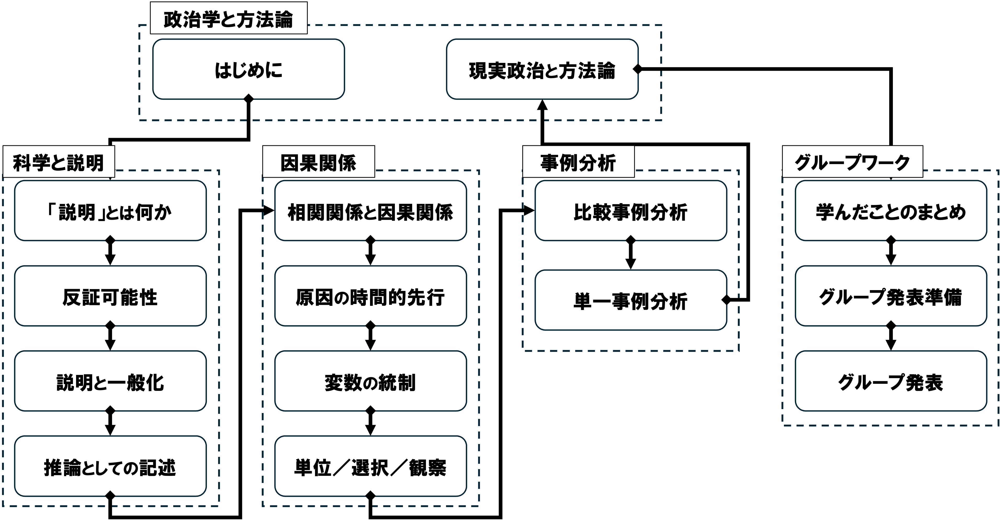

## 今日の目次

1. はじめに
1. 授業概要
1. 諸注意と評価
1. アイスブレイク
1. まとめ

# はじめに

## 本日の目的と到達目標
#### 目的
本科目の目的・計画・評価方法・諸注意を紹介し、受講の可否の判断材料を提供する。仲間と受講の動機を共有し、今後学んでいくための環境を整える。

#### 到達目標
1. 本科目「現代政治分析入門1」の目的、進め方、評価方法を他人に説明できる。
1. 自分の興味関心を言語化し、本科目で学びたいことを他人に説明できる。
1. 学ぶ仲間の名前を4人以上言うことができる。

## 担当者の自己紹介
::: {.columns}
::: {.column width=25%}

 - [[email]{.button}](mailto:jsuzuki@iss.u-tokyo.ac.jp)
 - [[webpage]{.button}](https://junpei-suzuki.github.io)
 - [[researchmap]{.button}](https://researchmap.jp/junpeisuzuki-ps)
:::

::: {.column width=5%}
:::

::: {.column width=70%}
**鈴木淳平**（すずき・じゅんぺい）

駒澤大学法学部政治学科講師

 - 学位：早稲田大学博士（政治学）（2024年）
 - 職歴：早稲田大学助手→東京大学特任研究員→駒澤大学講師
 - 専門：先進諸国の比較政治経済学
 - 居室：第二研究館2825室
:::

:::

## アンケート①

今日の調子はいかがですか？

1. 良い
1. まあまあ
1. 悪い

## アンケート②

今、何年生ですか？

1. 1年生
1. 2年生
1. 3年生
1. 4年生

## アンケート③

教室の中を見渡してみましょう。何人名前を知っている人がいますか？

1. 0人
1. 1人
1. 2人
1. 3人以上

# 授業概要
## 授業概要
 - 現代の政治分析＝さまざまな**政治現象の原因をデータや証拠に基づいて探究**
 - **政治学において因果推論を行う理論的視座**を身につける
 - **社会科学方法論の基礎**を学ぶ
 - **講義方式**によるが、**アクティブラーニング**を用いたワークを積極的に活用

## 到達目標

1. 政治学において厳密な**因果推論を行うことの意義**を説明できる。
1. さまざまな政治現象について、**「科学的な説明」とそうでない説明を識別**できる。
1. **因果関係の定義**とそれを**立証するための基本的な方法**を説明できる。
1. **少数の事例から因果関係を推論・実証**する基本的な方法を説明できる。
1. 自らの興味関心に沿って、**因果推論を伴う基本的な研究計画を立案**できる。
1. グループワークを通じて、**相互に学びの深化に貢献**できる。

## 進行計画

# 諸注意と評価

## 授業の進め方

 - 基本的は対面の講義方式で、スライドを使用
    - ただし 14 回までオンライン振替の可能性
 - 授業資料等はWebClassで共有
    - スライドのハードコピーは配布はしない予定なので、各自でダウンロードすること
    - ただしワークシートなどを配布することがある
 - 随時アクティブラーニングも取り入れ、「聞くだけ」の授業にはしない
    - 事前・事後学習、問いかけ、アンケート、ディスカッション⋯
 - 特に期末3回はグループワークによる復習と政治分析の練習を行う

## 事前・事後学習

#### 事前学習

 - 指定された教科書等の該当部分を読む→授業開始までにWebClass上のチェックフォームに記入
 - **【教科書・購入必須】**久米郁男（2025）『原因を推論する［新版］』有斐閣．
     - これ以外の文献も事前学習課題として指定されることがある（WebClassで共有）

#### 事後学習

 - 授業の**3日後（金曜日）**を締切として、オンラインのフォーム上でリアクションペーパー記入（合計200字程度）
     - 次回授業でなるべくフィードバック予定

## 連絡方法とオフィスアワー

 - コンタクトは必ず担当者のメールアドレスに行うこと
    - WebClassのメッセージ機能では気づかない可能性大
 - メールを送付する際は「[メールの書き方](http://www2.ipcku.kansai-u.ac.jp/~iwamoto/email.pdf)」を必ず参照し、形式やマナーを守ること
 - オフィスアワー（OH）：**木曜日4限　2研2825室** 
    - **OH中はアポなしで来室可能**
    - これ以外でもアポにより対応可能

## その他注意

 - オンラインのツールを用いることがあるので、できるだけ電子機器持参
 - 授業計画は若干の変更の可能性あり
 - データ分析に特化した「現代政治分析入門2」の履修も合わせて推奨

## 評価

**レポート**（50%）⋯グループで研究計画案の作成と発表

 - 仮説を提示し、その検証のための方法を立案できているか評価（40%）
 - グループ作業で相互協力できているか評価（10%）

**平常点**（30%）⋯事後学習のリアクションペーパー

 - 授業で学んだことと感想（20%）
 - 相互推薦による参加度合いの評価（10%）

**復習セッション**（20%）⋯第13回に実施

 - 4グループ程度に分かれてワークし、その成果を共有
 - ワークでの貢献度および成果の質を、相互評価も加味しつつ評価

## 相互推薦システム

 - アクティブラーニングへの積極的な参加を評価
     - その回の授業でのワーク等で良い働きをしたと思われる他の受講生を推薦
 - 推薦は任意で、推薦する場合は理由を記載
     - 理由が具体的かつ明確でない場合は推薦不成立
 - 対象授業期間[^target]を通じて推薦された回数をカウントし、次のように加点
     - 対象期間中12回以上推薦獲得→基礎点として平常点4ポイント分獲得
     - それ以降は4回の推薦につき平常点2ポイントを追加
     - 全24回推薦された場合は平常点の満点10ポイント

[^target]: 各期の初回・まとめ回・試験回を除く全 24回

# アイスブレイク
## はじめに
#### 目的
 - 共に学ぶ仲間のことを知る
 - それぞれの受講動機を明確にする
 - グループワークに慣れる

#### 到達目標
 1. 2名以上の受講者の名前を言える
 1. 自分の受講動機を明確に他者に説明できる
 1. このクラスを安心な場となるような振る舞いができる

## グラウンドルール

学び合う環境づくりのために…

 - 「さん」づけで呼びましょう
 - どんなことからでも学べるつもりで
 - 相手の話を関心をもってよく聴く
 - **3K**⋯敬意を持って、忌憚なく、建設的に

## アイスブレイクの手順
::: {style="font-size: 0.9em;"}
 1. 受講動機を整理する（個人：1分）
    - どこかにメモをする
 1. お互いを知る①（ペア：1:30×2人）
    - 2人組になる
    - あいうえお順で早い方から自己紹介
    - 相手の名前・出身高校・所属部活／サークル・受講動機を聴き、メモする
 1. お互いを知る②（グループ：1:30×4人）
    - ペア2組を合併して、4人グループを作る
    - ペアの相手の名前・出身高校・所属部活／サークル・受講動機を、新たなグループメンバーに紹介する
    - 順番は、あいうえお順で遅い方のいるペアから、遅い方が先に紹介
    
:::

# まとめ

## 本日の目的と到達目標
#### 目的
本科目の目的・計画・評価方法・諸注意を紹介し、受講の可否の判断材料を提供する。仲間と受講の動機を共有し、今後学んでいくための環境を整える。

#### 到達目標
1. 本科目「現代政治分析入門1」の目的、進め方、評価方法を他人に説明できる。
1. 自分の興味関心を言語化し、本科目で学びたいことを他人に説明できる。
1. 学ぶ仲間の名前を4人以上言うことができる。

## 次回までに

#### 事後学習

 - 授業資料を見直し、目標到達をセルフチェック
 - WebClass上でのリアクションペーパー入力（金曜日まで）

#### 事前学習

 - 教科書（序章、1章）を読み、WebClass上でのチェックフォーム記入

