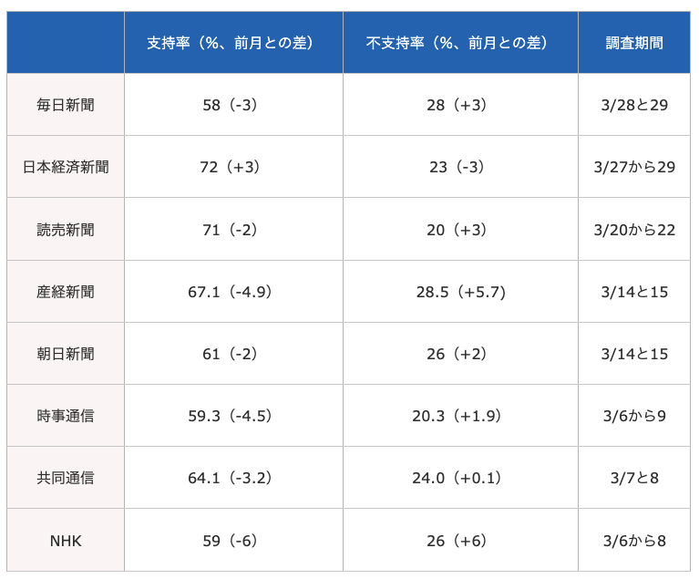

## 出席登録をお願いします

## 今日の目次

1. はじめに
1. 推論としての記述
1. 確率的誤差
1. 世論調査とバイアス
1. 操作化によるバイアス
1. まとめ

# はじめに
## 先週のRPより
TBD

## 本日の目的と到達目標
::: {style="font-size: 0.8em;"}
#### 目的
因果推論の前提となる「記述」について根本的に考える。記述を歪める誤差とバイアスについて検討するとともに、計量的手法や質的手法に潜む記述の問題を考察できるようになることを目指す。

::: {.fragment .fade-in}
#### 到達目標
1. 「記述には推論としての側面が含まれている」とはどういうことか説明できる。
1. 真実と観測の差である誤差が発生する2つの原因を列挙することができる。
1. 量的調査で確率的誤差を最小限にすれにはどうすれば良いかを説明できる。
1. ランダムサンプリングの失敗が世論調査にどのような影響を与えるのか、実際の事例を用いて説明できる。
1. 一定の質を満たした操作化の方法を考案することができる。

:::

:::

## 本日の授業の位置付け

# 推論としての記述
## 質問
今日の教科書の該当部分（久米第4章）には『記述は推論という性格を持つ』というようなことが書かれて部分がありました。

該当の箇所を探し、どういうことが書かれているか確認してください。

（隣同士で協力してもよいです。）

## 記述と推論
::: {.fragment .fade-in}
#### 記述（description）
::: {.incremental}
 - 「**どうなっているのか**」を明らかにすること
    - 何かを観測し、その結果を述べる
 - 例：「Aさんの身長を測定した結果、180cmだった」

:::
:::

::: {.fragment .fade-in}
#### 推論（inference）
::: {.incremental}
 - 「**知っていること**」から「**まだ知らないこと**」を**推測**すること
 - 観測結果は真実を全て反映しているわけではない→記述も推論
 - 例：Aさんの身長は180cm→誤差が含まれる

:::
:::

## 測定誤差 (measurement error)
真の値と観測値の間のずれ

::: {.fragment .fade-in}
#### 2種類の測定誤差
::: {.incremental}
 - **確率的誤差** (stochastic error)…**偶然**によって生まれたずれ
 - **系統的誤差** (systematic error)…**特定の原因**によって生まれたずれ
    - **バイアス**（bias；歪み）とも呼ぶ
    - 常に特定の方向をもつ→真の値よりも大きいor小さい
    - 社会的望ましさバイアス、サンプリングバイアス、調査設計によるバイアス、操作化によるバイアス…

:::
:::

# 確率的誤差
## 質問
あなたは駒大生の高市内閣の支持率を知りたいと思い、キャンパスで偶然出会った10人に高市内閣を支持するか否かを聞きました。

::: {.fragment .fade-in}
その結果10人中10人が高市内閣を支持すると答えました。
:::

::: {.fragment .fade-in}
この結果から、駒大生は全員高市支持者だと結論付けてよいと思いますか？
:::

## 世論調査 (opinion poll)
::: {.fragment .fade-in}
内閣・政党・政策に対する**市民全体**の賛否を測る
:::

::: {.incremental}
- 市民全員に聞くのが理想→コストが高すぎる
- **ランダムサンプリング**…全体（**母集団**）から一部（**標本**、**サンプル**）をランダムに抽出
- サンプルを分析し、その結果から母集団の賛否を推測
- ただし結果は**確率的誤差**を含む
  - サンプルは一部が偶然選ばれただけ
  - 結果も偶然そうなっただけかもしれない
  - もし別の人が選ばれていたら違う結果

:::

## 質問 (WebClassチャット)
より正確に駒大生の高市内閣支持を測定するために調査をどうに改善すればいいでしょうか？

{.r-stretch}

## 推測統計学 (statistical inference)
サンプルの性質から母集団の性質を推測する際に用いられる統計学の方法

::: {.fragment .fade-in}
→基本的には**サンプルサイズ**を大きくすればよい

::: {.incremental}
 - **サンプルサイズ**…標本に何人／何個分のデータがあるか
 - **サンプル数**…データのセットである標本がいくつあるか

:::
:::

::: {.fragment .fade-in}
**大数の法則**と**中心極限定理**（補足ビデオ参照）
:::

# 世論調査とバイアス
## 米大統領選と世論調査
::: {.columns}
::: {.column width=70%}
**2016年アメリカ大統領選挙**

::: {.incremental}
 - **ヒラリー・クリントン**（民主党）vs.**ドナルド・トランプ**（共和党）
 - 主要メディアはヒラリーの勝利を予測
 - 結果はトランプの勝利

:::

::: {.fragment .fade-in}
Q. なぜ世論調査の予測と結果がずれた？
:::

:::

::: {.column width=30%}

:::

:::

## バイアスに関する説明[^USelection]
::: {style="font-size: 0.9em;"}
::: {.fragment .fade-in}
#### 社会的望ましさバイアス (Social Desirability Bias: SDB)
::: {.incremental}
- **「隠れトランプ」仮説** (shy-voter hypothesis)とも
   - トランプ支持を公言できない雰囲気
   - 世論調査に嘘の回答→トランプ支持を過小評価
- **政治学では支持されていない**

:::
:::

::: {.fragment .fade-in}
#### サンプリングバイアス (sampling bias)
::: {.incremental}
- 社会的属性により世論調査への参加率に差→ランダムサンプリングが機能不全
- 高学歴層の方が世論調査に参加する傾向
   - 高学歴層→左派／リベラルな価値観
   - ヒラリー支持が過大評価されるバイアス

:::
:::

[^USelection]: 飯田健（2020）「[2016年大統領選挙に関する実証研究の知見と2020年大統領選挙](https://www.jiia.or.jp/jpn/report/2020/10/research-report_post-16.html)」

:::

## 報道各社の高市内閣支持率（26年3月）
{.r-stretch}

[Source](https://www.policynews.jp/polls/2026/03all.html)

::: {.notes}
朝日や毎日やNHKは左翼だから高市が嫌いで支持率を低くしている→陰謀論めいた間違い
:::

## 調査設計によるバイアス
各社の支持率の違いは調査設計の違いによる

::: {.fragment .fade-in}
#### 「重ね聞き」
「どちらでもない」という回答者に改めて聞く

::: {.incremental}
- 読売・日経・産経はする→支持率が高く出る
- 毎日・朝日・NHKはしない→支持率が低く出る

:::

:::

# 操作化によるバイアス
## 復習：操作化 (operationalization)
::: {.fragment .fade-in}
抽象的な概念を観察可能な変数を用いて定義し直すこと

::: {.incremental}
 - 「**測定** (measurement)」とも
 - 例：学力→試験の点数

:::

:::

::: {.fragment .fade-in}
よい操作化／測定が満たすべき3基準

::: {.incremental}
- **信頼性** (reliability)…誰が何回やっても同じ結果が出るか
   - 例：レポートを「良い・まあまあ・悪い」で評価
- **妥当性** (validity)…概念を適切に測定できているか
   - 例：[ジェンダー・ギャップ指数](https://president.jp/articles/-/71137)
- **効率性** (efficiency)…実際に可能かどうか

:::

:::

::: {.notes}
ジェンダー・ギャップ指数→日本は125位（2023）

日本より上位の国々

- ニカラグア（7位）…性暴力による未成年出産が多い

- ルワンダ（12位）…女性はインフォーマルセクター（農場などの無給家事労働、日雇い労働）で雇用

ジェンダーギャップ指数は男女差が測れる指標（管理職比率、国会議員比率）のみ対象→先進国が基本対象

ジェンダー・ギャップで日本が先進国では最低レベルとは言えるが、世界最悪とは言えない
:::

## 質問
以下の事例は信頼性と妥当性どちらに問題があると言えるでしょうか。またそれぞれどのように改善できるでしょうか。チャットに入力してください (3-5分)

 - 事例①：就活生を採用するかどうかを印象だけで決める
 - 事例②：ある国が民主主義か独裁か選挙の有無だけで分類する

{.r-stretch}

# まとめ
## 本日の目的と到達目標
::: {style="font-size: 0.8em;"}
#### 目的
因果推論の前提となる「記述」について根本的に考える。記述を歪める誤差とバイアスについて検討するとともに、計量的手法や質的手法に潜む記述の問題を考察できるようになることを目指す。

::: {.fragment .fade-in}
#### 到達目標
1. 「記述には推論としての側面が含まれている」とはどういうことか説明できる。
1. 真実と観測の差である誤差が発生する2つの原因を列挙することができる。
1. 量的調査で確率的誤差を最小限にすれにはどうすれば良いかを説明できる。
1. ランダムサンプリングの失敗が世論調査にどのような影響を与えるのか、実際の事例を用いて説明できる。
1. 一定の質を満たした操作化の方法を考案することができる。

:::

:::

## 次回までに
::: {.fragment .fade-in}
#### 事後学習

 - 授業資料を見直し、目標到達をセルフチェック
 - WebClass 上でのリアクションペーパー入力（金曜日まで）
 - 【任意】補足ビデオ「大数の法則と中心極限定理」の視聴（WebClass上）
 - 【任意】筒井淳也「[『日本はジェンダーギャップ125位』をそのまま受け取ってはいけない…『指数』が反映しきれない現実の世界](https://president.jp/articles/-/71137)」を読む

:::

::: {.fragment .fade-in}
#### 事前学習

 - 教科書（久米5章）を読み、WebClass 上でのチェックフォーム記入

:::