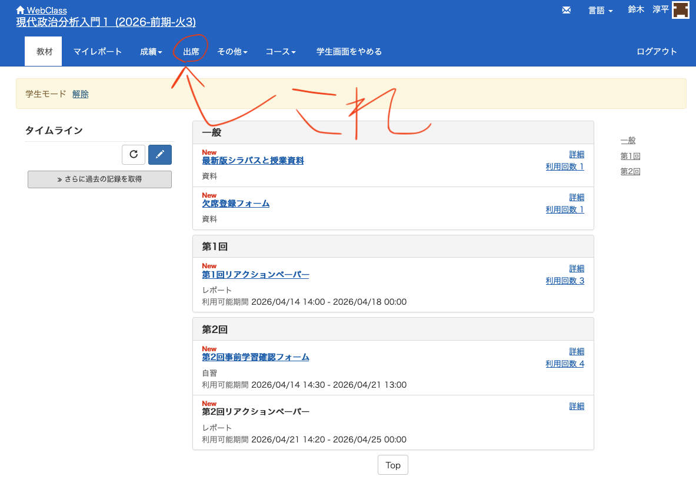
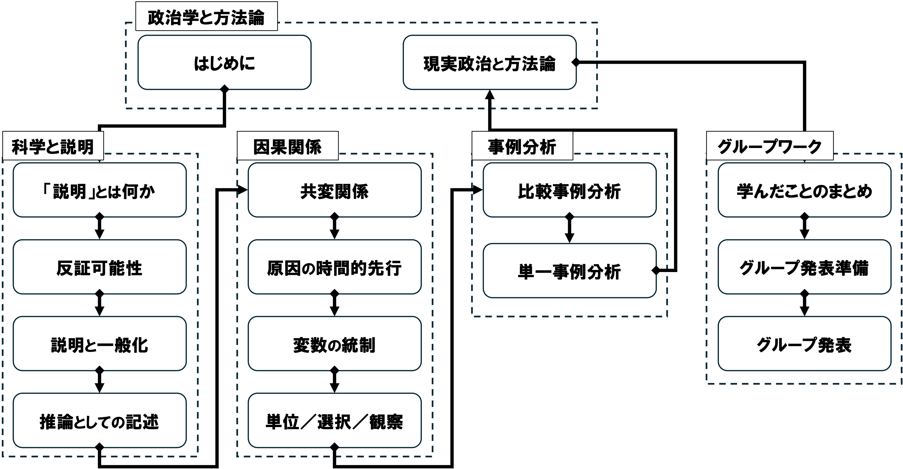
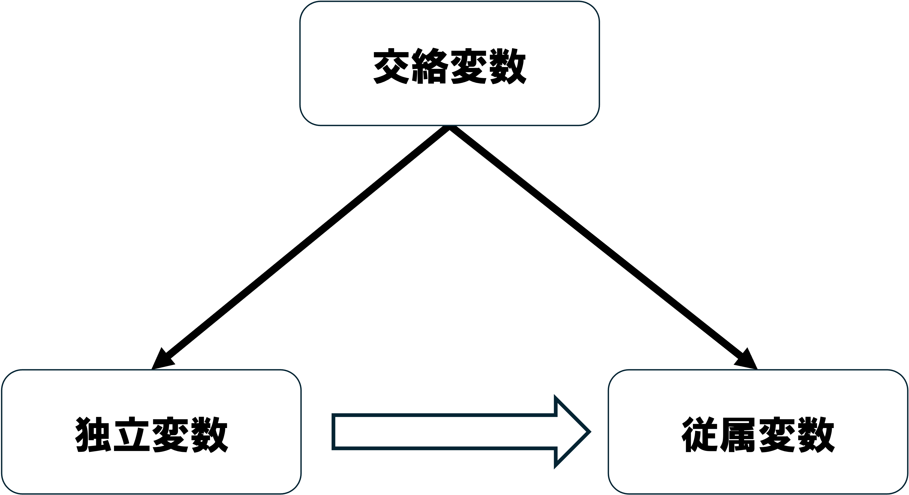
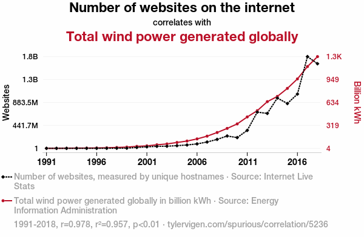
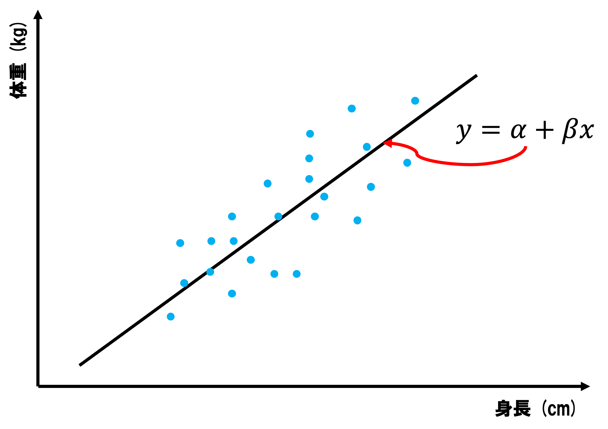
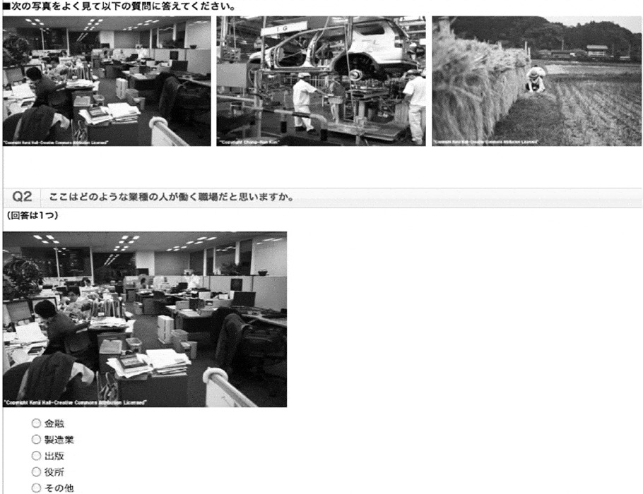
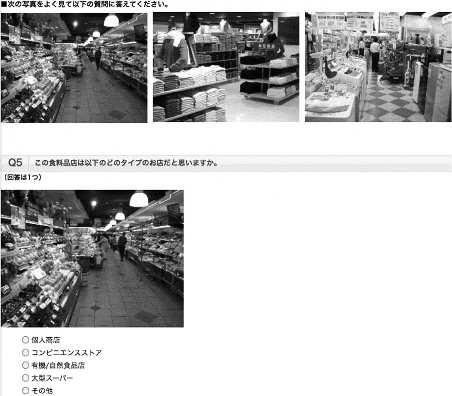
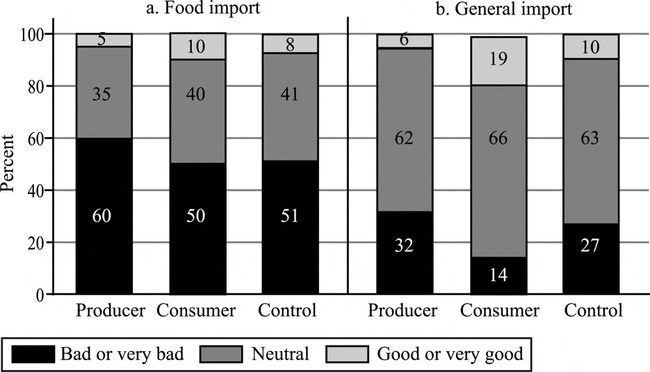

## 出席登録をお願いします

## 今日の目次

1. はじめに
1. 交絡変数
1. 回帰分析
1. 因果推論の根本問題
1. ランダム化対照実験／統計的因果推論
1. まとめ

# はじめに
::: {.notes}
目標15分
:::
## 先週のRPより (1/3)
同時性＝原因と結果の間に双方向の因果関係が存在

::: {.fragment .fade-in}
> 警察の例で従属変数が独立変数にどのように影響しているかまだ少し理解できていません。警察が増えると、犯罪率が低下する。これの同時性は犯罪率が高いと、警察が増えるということでしょうか。

:::

::: {.fragment .fade-in}
> 「所得水準が高い国ほど、教育水準も高くなる」について、同時性があるのはなぜですか。

:::

::: {.notes}
同時性について「わかりにくかった」との意見が多数

警察官と犯罪率

- 警察→犯罪率：警察官の増加が犯罪率を減らす
- 犯罪率→警察：犯罪率が高くなると警察官を増やす

所得水準と教育水準

- 所得→教育：豊かになれば教育に使える金が増えるので大学に進学するようになる
- 教育→所得：人々の教育レベルが高いと生産性が高まったり、イノベーションが生まれやすくなるので豊かになる

:::

## 先週のRPより (2/3)
> 同時性の問題を回避して因果関係の検証を行うのが難しくできなかった。どうすれば回避できるのかがわからなかった。

> 内生性や同時性により因果関係に歪みが生じる問題もあります。これらによる分析結果の歪みを防ぎ、妥当性を担保するには具体的にどうアプローチすべきでしょうか？

::: {.notes}
同時性も含めた内生性の解決方法

 - ランダム化対照試験（理想）
 - 次善の解決策：
   1. 理論的解決…原因が先行している、あるいは他の変数が統制されていると確実に言えるかどうかチェック
   1. 統計的解決…データ分析で工夫
      - 回帰分析
      - 統計的因果推論

:::

## 先週のRPより (3/3)
> 今回のスライドがその前のスライドと少し異なっておりPDF化が出来づらいと感じるので，出来るような形にしていただけると助かります。

::: {.fragment .fade-in}
> 先生の声に対して教場が騒がしいので何とかしてほしいと思った。

:::

::: {.notes}
スライド

- 時々出力がうまくいかずに申し訳ない。もう治っているはず。

教場の騒がしさ

- 教員が話しているときは静かにする。特に後ろ。

:::

## 本日の目的と到達目標
::: {style="font-size: 0.9em;"}
#### 目的
因果関係が満たすべき要件の1つである「変数の統制」について改めて考える。「交絡変数」「因果推論の根本問題」といった問題を学び、その解決策としての実験や観察データ分析の手法の概要を知り、自分の因果推論にとって適切な方法を選べることを目指す。

::: {.fragment .fade-in}
#### 到達目標
1. 交絡変数とは何かを説明できる。
1. 重回帰分析で交絡変数を投入した際に何が起こるのかを説明できる。
1. 因果推論の根本問題とは何かを説明できる。
1. 仮説に対応した、簡単なランダム化対照試験を設計できる。
1. 統計的因果推論の内的妥当性および外的妥当性について議論できる。

:::

:::

## 本日の授業の位置付け

# 交絡変数
::: {.notes}
ここまで15分

目標15分
:::
## 復習：3条件と内生性
::: {.fragment .fade-in}
#### 因果関係の3条件
1. **共変関係**
1. 原因の時間的先行
1. 他の変数の統制
:::

::: {.fragment .fade-in}
#### 内生性 (endogeneity)
共変関係が観察されたとしても、本当の**因果効果**が歪んでしまう問題

::: {.incremental}
- **同時性**…原因の時間的先行がない（前回）
- **欠落変数**…他の変数が統制されていない（今回）
- **観測誤差**…独立変数の測定にずれ（第5回）

:::
:::

## 交絡変数 (confounding variable)
{.r-stretch}

::: {.notes}
**交絡変数** (confounding variable, confounder)…独立変数（原因）と従属変数（結果）両方に影響する変数

- 例：朝食と成績←家庭環境
   - 家庭環境がいいと朝食を食べる
   - 家庭環境がいいと成績がいい
   - 朝食と成績は「**見せかけの相関**（spurious correlation）」

:::

<!-- ## 見せかけの相関 (spurious correlation)[^spurious] -->
<!-- {.r-stretch} -->

<!-- [^spurious]: Tyler Vigen "[Spurious Correlations](https://www.tylervigen.com/spurious-correlations)" -->

## Think-pair-share (-10分)
[インターネット上のウェブサイトの数と世界の風力発電量には明確な相関](https://www.tylervigen.com/spurious/correlation/5236_number-of-websites-on-the-internet_correlates-with_total-wind-power-generated-globally)があります。

この2つの変数にはなぜ相関が出るのだと思いますか？

- **Think** (1-2分)…1人で考える
- **Pair** (1-2分)…ペアで共有する
- **Share** (2-3分)…全体に共有する（[WebClassチャット](https://webclass.komazawa-u.ac.jp/webclass/login.php?id=06db2a85267405d46353108f5448252f)）

{.r-stretch}

# 回帰分析
::: {.notes}
ここまで30分

目標20分
:::
## 回帰分析 (regression analysis)
独立変数と従属変数の関係を示すモデルを推定する分析

::: {.fragment .fade-in}
**単回帰**…独立変数が1つだけの回帰分析

:::

::: {.fragment .fade-in}
{width=60%}

:::

::: {.fragment .fade-in}
**重回帰**…独立変数が複数の回帰分析

:::

::: {.notes}
回帰分析…データにうまく当てはまるように切片$\alpha$と傾き$\beta$を求める

- 最小二乗法…詳しくは統計学の教科書を参照
- 手計算でもできるが、基本はコンピュータにやらせる

:::

## 表7-1 TPPへの態度 (p.146)
::: {style="font-size: 0.9em;"}
$$
y= \alpha+\beta_{1} x_{1}+\beta_{2} x_{2}+\beta_{3} x_{3}
$$

::: {.incremental}

- TPPへの態度 ($y$)…賛成=1〜反対=5
- 性別($x_{1}$)…男性=1、女性=2
- 年齢($x_{2}$)…実年齢
- 学歴($x_{3}$)…中卒以下=1、高卒=2、専門・短大卒=3、大卒以上=4
- $\alpha$は切片、$\beta_{(\cdot)}$はそれぞれの係数（傾き）

:::

::: {.fragment .fade-in}
|          | B      | 標準誤差 | β     | t値    | 有意確率 | 
| -------- | ------ | -------- | ------ | ------ | -------- | 
| （定数） | **3.413**  | 0.173    |        | 19.693 | **0.000**    | 
| 性別     | **0.271**  | 0.049    | 0.102  | 5.481  | **0.000**    | 
| 年齢     | **-0.018** | 0.002    | -0.182 | -9.821 | **0.000**    | 
| 学歴     | **-0.076** | 0.030    | -0.048 | -2.562 | **0.000**    | 

:::

:::

## 表7-2 TPPへの態度 (p.147)
$$
y= \alpha+\beta_{1} x_{1}+\beta_{2} x_{2}+\beta_{3} x_{3}+\beta_{4} x_{4}
$$

::: {.incremental}

- 所得($x_{4}$)…200万円未満=1〜1400万円以上=8

:::

::: {.fragment .fade-in}
|          | B      | 標準誤差 | β     | t値    | 有意確率 | 
| -------- | ------ | -------- | ------ | ------ | -------- | 
| （定数） | **3.495**  | 0.183    |        | 19.118 | **0.000**    | 
| 性別     | **0.287**  | 0.052    | 0.107  | 5.536  | **0.000**    | 
| 年齢     | **-0.016** | 0.002    | -0.163 | -8.290 | **0.000**    | 
| 学歴     | **-0.045** | 0.032    | -0.028 | -1.410 | **0.159**    | 
| 所得     | **-0.085** | 0.014    | -0.114 | -5.854 | **0.000**    | 

:::

## クイズ
::: {style="font-size: 0.8em;"}
表7-1では確かめられていた学歴の効果が、所得を入れた表7-2では消えてしまいました。

なぜ効果が消えてしまったのでしょうか。

以下の選択肢から正しい理由を選んでください。

1. TPP賛成の人ほど学歴が高くなるから
1. 高学歴の人ほど所得も高い傾向があり、実際には所得がTPP態度に関係していたから
1. 所得を入れるとデータ数が減るから
1. 重回帰分析では、後から入れた変数の方が優先されるから

[WebClass](https://webclass.komazawa-u.ac.jp/webclass/login.php?id=510a5dabc784642b0bb7f2d725465cc8&page=1)で回答

:::

{width=20%}

## 重回帰分析と因果推論
::: {.fragment .fade-in}
交絡変数はモデルに投入して**統制**可能

::: {.incremental}
- 学歴の効果（$-0.076$→$-0.045$）…所得の影響を**差し引き**

:::
:::

::: {.fragment .fade-in}
すべての交絡因子を特定するのは不可能

:::

::: {.fragment .fade-in}
同時性や測定誤差の問題は残る

:::

# 因果推論の根本問題
::: {.notes}
ここまで50分

休憩5分

目標15分
:::
## 質問
ある日あなたは風邪をひき38度の熱が出ました。

そこでおばあちゃんが手作りの薬をくれました。

これを飲んだところ、次の日には本当に36.5度まで熱が下がりました。

この薬に効果はあったと結論づけて良いでしょうか？

[WebClassチャット](https://webclass.komazawa-u.ac.jp/webclass/login.php?id=172d46287b2cb28bd9f8766f65f9f2c4)で回答

{.r-stretch}

## 因果推論の根本問題
因果効果を測定するためには、**現実**の結果と**反事実**の結果を比較する必要があるが、**反事実**の結果を観察することは決してできない[^imai2025]

::: {.fragment .fade-in}
おばあちゃんの薬の例：

::: {.incremental}
- 現実＝薬を飲んだ後の体温（$36.5$度）
- 反事実＝薬を飲まなかった場合の体温（$38$度）
- 因果効果：$38-36.5=1.5$度
   - 薬の服用以外は全く同じ状況での比較＝**単位同質性**がある
- 薬を飲まなかった場合の体温は観察不能
   - $?-36.5=?$

:::
:::

[^imai2025]: - ローデ，エレーナ&今井耕介（2025）『新・社会科学のためのデータ分析入門　導入編』（原田勝孝訳）岩波書店，p.45．

::: {.notes}
因果推論は異なった「世界線」間の比較をしなければならない
- 現実（薬を飲んだ後の体温36.5度）は、ひょっとしたら自然治癒力の結果かもしれない。
- 反事実…薬が本当に効くとして、飲まなかった場合の対応＝風が治らず38度のまま
:::

## 根本問題の解決法
::: {.fragment .fade-in}
**科学的解決**…単位同質性が間違いなく確保されていると言える

::: {.incremental}
- 例：アサガオのでんぷん実験
   - 葉の一部を隠す→日光に当てた後ヨウ素液につける
   - 隠された部分と隠されていない部分…厳密には違うが**科学的には同じ**

:::
:::

::: {.fragment .fade-in}
**統計的解決**…単位同一性のある状況を人工的に作り出す

::: {.incremental}
- ランダム化対照実験 (RCT)
- 統計的因果推論

:::
:::

# ランダム化対照実験／統計的因果推論
::: {.notes}
ここまで70分（1:10:00）

目標15分
:::
## ランダム化対照実験
#### Randomized Controlled Trial (RCT)
研究対象者をランダムにグループ分けし、治療法や介入などの効果を検証する方法

::: {.fragment .fade-in}
新薬の治験：

::: {.incremental}
- 被験者をランダムに2分割
- 一方には偽薬（プラセボ）、もう一方には本物の新薬
   - **プラセボ効果**…偽薬でも体調に変化
- 偽薬群と新薬群で症状を比較

:::
:::

::: {.fragment .fade-in}
**サーベイ実験** (survey experiment)…世論調査にRCTを組み込む

:::

## 直井・久米の実験
::: {.fragment .fade-in}
オンラインの世論調査

::: {.incremental}
- 食糧輸入／輸入一般に対する賛否

:::
:::

::: {.fragment .fade-in}
回答者1200人をランダムに以下のグループに分割

::: {.incremental}
1. **統制群**：何も見せずに回答
1. **処置群①**：生産者意識を刺激する画像を見て回答
1. **処置群②**：消費者意識を刺激する画像を見て回答

:::
:::

## 実験刺激と結果
::: {.r-stack}
{.fragment}

{.fragment}

{.fragment}
:::

::: {.notes}
結果：

- 食糧輸入に対しては輸入一般よりも否定的
- 生産者刺激は食糧輸入への否定感を強める
- 消費者刺激は輸入一般への肯定感を強める
- 生産者刺激の効果が人によって違う
:::

## 統計的因果推論
::: {.fragment .fade-in}
RCTはいつでもできるわけではない

::: {.incremental}
- 金銭面のコスト
- 倫理面の問題

:::
:::

::: {.fragment .fade-in}
#### 統計的因果推論 (statistical causal inference)
**観察データ**から因果推論をする手法

::: {.incremental}
- 実験データではないデータ
- 自然実験、差分の差分、操作変数、回帰不連続デザイン、マッチング…

:::
:::

::: {.fragment .fade-in}
RCTも統計的因果推論も**内的妥当性**は高いが**外的妥当性**が低い

::: {.incremental}
- Q. 教科書（第7章）のどこで議論されている？

:::
:::

::: {.notes}
RCTの限界

- 金銭面のコスト…サーベイ実験で数十万、新薬の実験なら数億
- 倫理面…朝食を食べさせるか抜かせるか
:::

# まとめ
::: {.notes}
ここまで85分（1:25:00）

目標5分
:::
## 本日の目的と到達目標
::: {style="font-size: 0.9em;"}
#### 目的
因果関係が満たすべき要件の1つである「変数の統制」について改めて考える。「交絡変数」「因果推論の根本問題」といった問題を学び、その解決策としての実験や観察データ分析の手法の概要を知り、自分の因果推論にとって適切な方法を選べることを目指す。

::: {.fragment .fade-in}
#### 到達目標
1. 交絡変数とは何かを説明できる。
1. 重回帰分析で交絡変数を投入した際に何が起こるのかを説明できる。
1. 因果推論の根本問題とは何かを説明できる。
1. 仮説に対応した、簡単なランダム化対照試験を設計できる。
1. 統計的因果推論の内的妥当性および外的妥当性について議論できる。

:::

:::

## 次回までに
::: {.fragment .fade-in}
#### 事後学習

 - 授業資料を見直し、目標到達をセルフチェック
 - WebClass 上でのリアクションペーパー入力（金曜日まで）
    - コロナワクチンの「危険性」とその検証方法について（500字）
 
:::

::: {.fragment .fade-in}
#### 事前学習

 - 教科書（久米8章）を読み、WebClass 上でのチェックフォーム記入

:::
