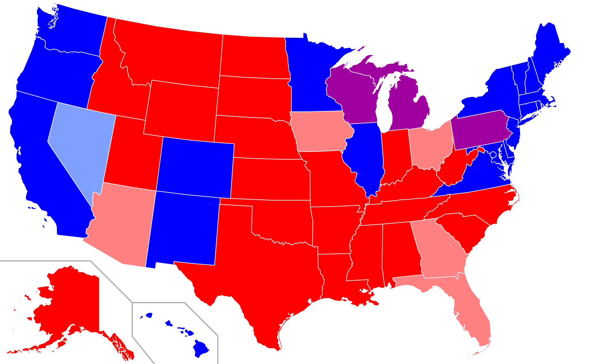
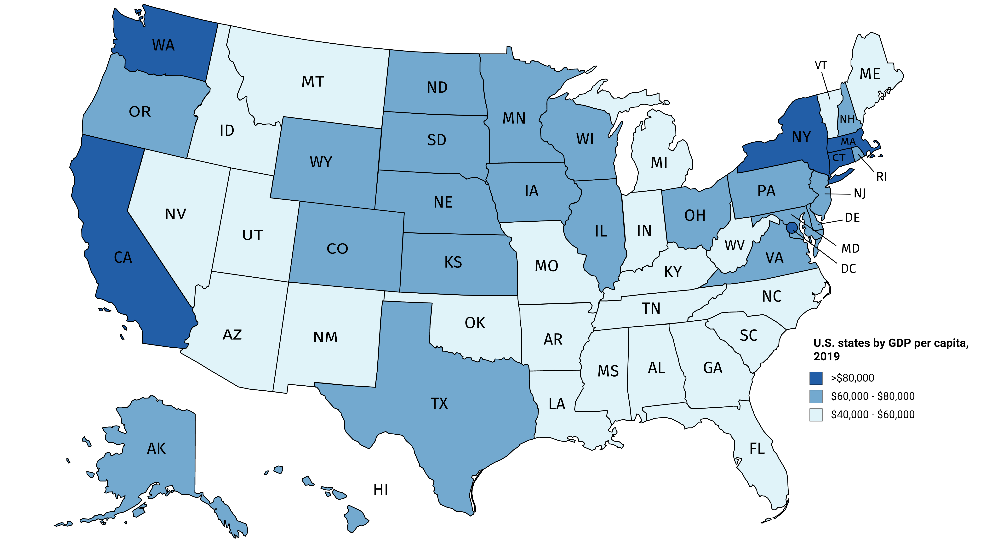

```{r set-up}
set.seed(19940309) # Someone's birthday
pacman::p_load(tidyverse,
               rlang,
               pak)
# Load the package(s)
theme_set(theme_bw()) # Set ggplot theme
```

## 出席登録をお願いします


## 今日の目次

1. はじめに
1. 理論仮説と作業仮説
1. 分析の単位
1. 選択のバイアス
1. 観察の範囲
1. まとめ

# はじめに
## 先週のRPより
TBD

## 本日の目的と到達目標
::: {style="font-size: 0.9em;"}
#### 目的
これまで学んできたことを踏まえ、因果推論でさらに発生する問題について考察する。分析単位や観察対象の選択などの問題について深く検討し、ふさわしい分析対象の選択について理解する。

::: {.fragment .fade-in}
#### 到達目標
1. ある理論仮説から2つ以上の作業仮説を作り出すことができる。
1. 自分の検証したい仮説の分析の単位を特定できる。
1. 具体例を用いながら生態学的誤謬とは何かを説明できる。
1. 従属変数に基づいてサンプルを抽出するとどのような問題が起こるのかを説明できる。
1. 自分の検証したい仮説に応じて観察の範囲を設定することができる。

:::

:::

## 本日の授業の位置付け


# 理論仮説と作業仮説
## 復習：仮説と説明
::: {.fragment .fade-in}
#### **説明** (explanation)
なぜを明らかにすること

:::

::: {.fragment .fade-in}
#### **仮説** (hypothesis)
真偽はさておき、何らかの現象を説明する命題

::: {.incremental}
- 「〜ではないか」という推測→データで検証する必要
- 2つのレベル：
   - **理論仮説**…概念同士の関係性を抽象的に述べたもの
   - **作業仮説**…理論仮説をデータで検証できるように具体化したもの
      - cf. 操作化

:::
:::

## デュルケム『自殺論』
::: {.columns}
::: {.column width=75%}
異なる社会における自殺率の差

::: {.fragment .fade-in}
|            | カトリック系 | プロテスタント系 | 
| ---------- | ------------ | ---------------- | 
| **ドイツ系**   | 自殺率　低い | 自殺率　高い     | 
| **フランス系** | 自殺率　低い | 自殺率　高い     | 

:::

::: {.fragment .fade-in}
仮説「**宗派の違い**が**自殺率の違い**をもたらす」

:::

::: {.fragment .fade-in}
因果関係の3条件

- [ ] 共変関係
- [ ] 原因の時間的先行
- [ ] 他の変数の統制

:::

:::

::: {.column width=25%}

:::
:::

## デュルケム仮説再考
::: {.fragment .fade-in}
|          | 原因                               | 結果             | 
| -------- | ---------------------------------- | ---------------- | 
| **理論仮説** | 社会的結合（高／低）               | 不安（低／高）   | 
| **作業仮説** | 宗派（カトリック／プロテスタント） | 自殺率（低／高） | 

:::

::: {.fragment .fade-in}
ありうる3種類の仮説

::: {.incremental}
- プロテスタント**国**の方が、カトリック**国**よりも自殺率が高い
- ドイツにおけるプロテスタント**地方**の方が、カトリック**地方**よりも自殺率が高い
- フランスにおけるプロテスタント**信者**の方が、カトリック**信者**よりも自殺率が高い

:::
:::

## Think-pair-share (-10分)
「政治不信が政治参加を抑制する」という理論仮説から、作業仮説を2個以上作ってみてください。

- **Think** (1-2分)…1人で作業
- **Pair** (2-3分)…ペア・周りで意見交換
- **Share** (2-3分)…全体に共有（[WebClassチャット](https://webclass.komazawa-u.ac.jp/webclass/login.php?id=9d1f00886a3bd257efbfcf89a85add18)）

{.r-stretch}


# 分析の単位
## 分析の単位 (unit of analysis)
::: {style="font-size: 0.9em;"}
研究や仮説が**対象とするものの単位**

::: {.fragment .fade-in}
何と何の比較なのか？

::: {.incremental}
- 「プロテスタント国の方が〜」→**国**
- 「ドイツにおけるプロテスタント地方の方が〜」→**地方**
- 「フランスにおけるプロテスタント信者の方が〜」→**個人**

:::
:::

::: {.fragment .fade-in}
データ分析との関係

::: {.fragment .fade-in}
| 学生  | 性別 | 出席回数 | 平常点 | 期末試験 | 
| ----- | ---- | -------- | ------ | -------- | 
| Aさん | 女性 | 13       | 17     | 89       | 
| Bさん | 男性 | 6        | 7      | 23       | 
| Cさん | 男性 | 11       | 15     | 55       | 
| …    | …   | …       | …     | …       | 

::: {.incremental}
- **観測の単位** (unit of observation)とも

:::
:::
:::
:::

## クイズ
次の仮説それぞれにおける分析の単位は個人・地方・国のうちどれしょうか。

- 農業が盛んなところでは自民党が強い。
- 民主主義になるほど戦争しなくなる。
- 義務感が強いと投票に行くようになる。

[WebClass](https://webclass.komazawa-u.ac.jp/webclass/login.php?id=d1c1030994fbef7cb963df7b282e0597&page=1)で回答してください。

{.r-stretch}

## 分析の単位の設定
理論や仮説の関心に応じて設定する必要

::: {.incremental}
- 単位が細かいと変数の統制はしやすい
   - 例：「フランスにおけるプロテスタント信者の方が〜」
   - フランス国内なので文化、気候、経済状況が大体同じ

- しかしデュルケムの関心は「社会的結合」

:::
::: {.fragment .fade-in}
理論・仮説と分析で単位がずれ→**生態学的誤謬**
:::

## 生態学的誤謬 (ecological fallacy)
集計レベルでの相関関係が個体レベルで成り立たないこと

::: {.fragment .fade-in}
アメリカの政党支持と所得

::: {.panel-tabset}
#### 大統領選結果
{width=70% fig-align="center"}

#### 州別1人あたりGDP
{width=70% fig-align="center"}

#### 個人別再集計
](figs/US_income_party.png){width=30% fig-align="center"}

:::
:::

::: {.notes}
数学力と所得の例…教科書p.168を確認

アメリカの政党支持と所得

- 大統領選結果
   - 過去4回で民主／共和どっちが勝ったか
   - 青／赤が濃ければ民主／共和寄り
   - 紫は引き分け
- 州別1人あたりGPD
   - 濃ければ豊か
   - 東海岸と西海岸は豊か→民主党が強い
   - 南部や西部（内陸部）は貧しい→共和党が強い
   - 金持ちが民主党支持、貧乏人が共和党支持？
- 個人別集計
   - 教育水準が交絡になるので分ける
   - 大卒者→所得にかかわらず民主党が強い
   - 大卒未満者→低所得層が民主党、高所得層が共和党

:::

# 選択のバイアス
## クイズ
::: {style="font-size: 0.9em;"}
第5回で2016年アメリカ大統領選挙における世論調査の問題について説明しました。

その内容として正しいものを以下から全て選んでください。

1. 高学歴層は自身をリベラルないしは左派と位置付ける傾向にあった。
1. アメリカではトランプ支持を公言することが憚られる状況にあった。
1. 低学歴層よりも学歴層の方が世論調査に対する回答率が高かった。
1. トランプ支持層は学歴が高い傾向にあった。

[WebClass](https://webclass.komazawa-u.ac.jp/webclass/login.php?id=2f68780421665591fb763c1daae60515&page=1)で回答してください。

{.r-stretch}

:::

## サンプリングバイアス
復習：2016年アメリカ大統領選挙

::: {.incremental}
- 予想外のトランプ勝利
- 世論調査…高学歴層の過大代表→トランプ支持の過小評価

:::

::: {.fragment .fade-in}
サンプル選択は因果効果の推定も歪める可能性

::: {.incremental}
- 特に**従属変数の値**に基づいた場合
- **独立変数の値**に基づいた場合は問題なし

:::
:::

::: {.fragment .fade-in}
Cf. **バークソンのパラドックス**（補足ビデオ）

- 特定の条件でデータを抽出すると無関係な変数同士に相関が見出されてしまうという問題
:::

## 洋画視聴とTOEIC
```{r m&t-setup}
#| include: false

data_1 <- tibble(
  x        = rnorm(100, mean = 4, sd = 1),
  y        = 600 + 20 * x + rnorm(100, mean = 0, sd = 10)
)

```
::: {.panel-tabset}
#### 全体
```{r m&t-all}
ggplot() +
  geom_point(aes(x = x, y = y),
             data = data_1) +
  geom_smooth(aes(x = x, y = y),
              method = "lm",
              se = FALSE,
              data = data_1) +
  labs(x = "洋画の視聴時間（時間/週）",
       y = "TOEICの点数")
```

#### TOEIC700点以上
```{r m&t-700+}
ggplot() +
  geom_point(aes(x = x, y = y),
             data = data_1,
             alpha = 0.1) +
    geom_point(aes(x = x, y = y),
             data = subset(data_1,
                           y >= 700)) +
  geom_smooth(aes(x = x, y = y),
              method = "lm",
              se = FALSE,
              data = subset(data_1,
                           y >= 700)) +
  labs(x = "洋画の視聴時間（時間/週）",
       y = "TOEICの点数")
```

#### 洋画5時間以上
```{r m&t-4+}
ggplot() +
  geom_point(aes(x = x, y = y),
             data = data_1,
             alpha = 0.1) +
    geom_point(aes(x = x, y = y),
             data = subset(data_1,
                           x >= 4)) +
  geom_smooth(aes(x = x, y = y),
              method = "lm",
              se = FALSE,
              data = subset(data_1,
                           x >= 4)) +
  labs(x = "洋画の視聴時間（時間/週）",
       y = "TOEICの点数")
```


:::

::: {.notes}
洋画視聴とTOIECの点数の関係

- 全体的には1時間あたり20点増える
- 全員に調査できないので英語強者（700点以上）だけに聞いてみよう
   - 相関（＝線の傾き）は大幅になだらか→因果効果の過小推定
- 全員に調査できないので洋画を4時間以上見る人だけに聞いてみよう
   - 線の傾きはあまり変わらない

:::


# 観察の範囲
## 観察の範囲（ユニバース）
仮説の検証のために想定されるサンプルの範囲

::: {.fragment .fade-in}
仮説に応じて決定する必要

:::

::: {.fragment .fade-in}
**恣意的な事例選択**→広げて再検討する必要

::: {.incremental}
- 女性労働参加と出生率
   - 謎の13カ国→OECD全体
- 労働抑圧と経済発展
   - アジア→途上国全体

:::
:::

---
::: {.fragment .fade-in}
民主化の「**近代化仮説**」論争→広げすぎるのも問題

::: {.incremental}
- リップセット「経済発展→民主主義」

:::
:::

::: {.fragment .fade-in}
論争の展開

::: {.incremental}
- プシェヴォルスキ「関係ない」
   - 民主主義の**存続**には関わる
- ボイッシュら「50年代以前に広げると相関」
- ゲッデス「民主化のプロセスは時代で異なる」
   - 20世紀以前…選挙権の拡大
   - 21世紀以降…国際的な圧力

:::
:::

## Think-pair-share (-10分)
「女性の社会進出は少子化を改善する」この仮説を検証するために、あなたなら以下のうちどの範囲のデータを集めますか？

1. 駒澤大学生
1. 東京都民
1. 日本国民
1. OECDの市民
1. 世界全体の市民

進行：

- **Think** (1-2分)…1人で考える（理由も含めて）
- **Pair** (2-3分)…ペア・周りで意見交換
- **Share** (2-3分)…全体に共有（[WebClassチャット](https://webclass.komazawa-u.ac.jp/webclass/login.php?id=9d1f00886a3bd257efbfcf89a85add18)）

# まとめ
## 本日の目的と到達目標
::: {style="font-size: 0.9em;"}
#### 目的
これまで学んできたことを踏まえ、因果推論でさらに発生する問題について考察する。分析単位や観察対象の選択などの問題について深く検討し、ふさわしい分析対象の選択について理解する。

::: {.fragment .fade-in}
#### 到達目標
1. ある理論仮説から2つ以上の作業仮説を作り出すことができる。
1. 自分の検証したい仮説の分析の単位を特定できる。
1. 具体例を用いながら生態学的誤謬とは何かを説明できる。
1. 従属変数に基づいてサンプルを抽出するとどのような問題が起こるのかを説明できる。
1. 自分の検証したい仮説に応じて観察の範囲を設定することができる。

:::

:::

## 次回までに
::: {.fragment .fade-in}
#### 事後学習

 - 授業資料を見直し、目標到達をセルフチェック
 - WebClass 上でのリアクションペーパー入力（金曜日まで）
 - 【任意】補足ビデオ「バークソンのパラドックス」の視聴（WebClass上）
 
:::

::: {.fragment .fade-in}
#### 事前学習

 - 教科書（久米9章）を読み、WebClass上でのチェックフォーム記入

:::