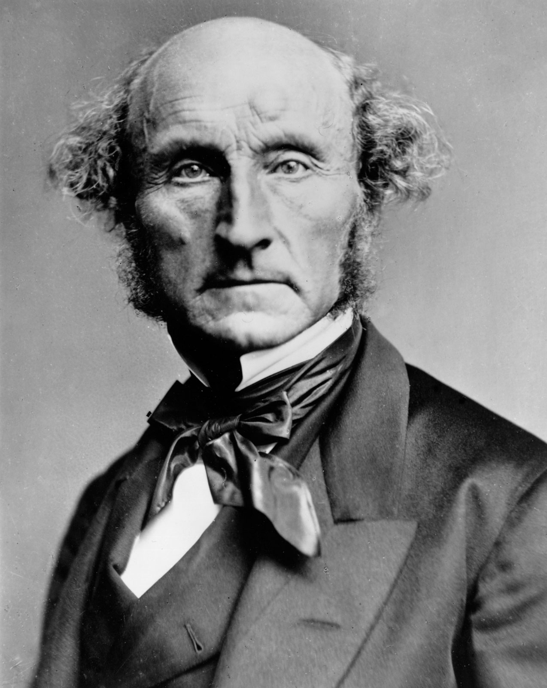
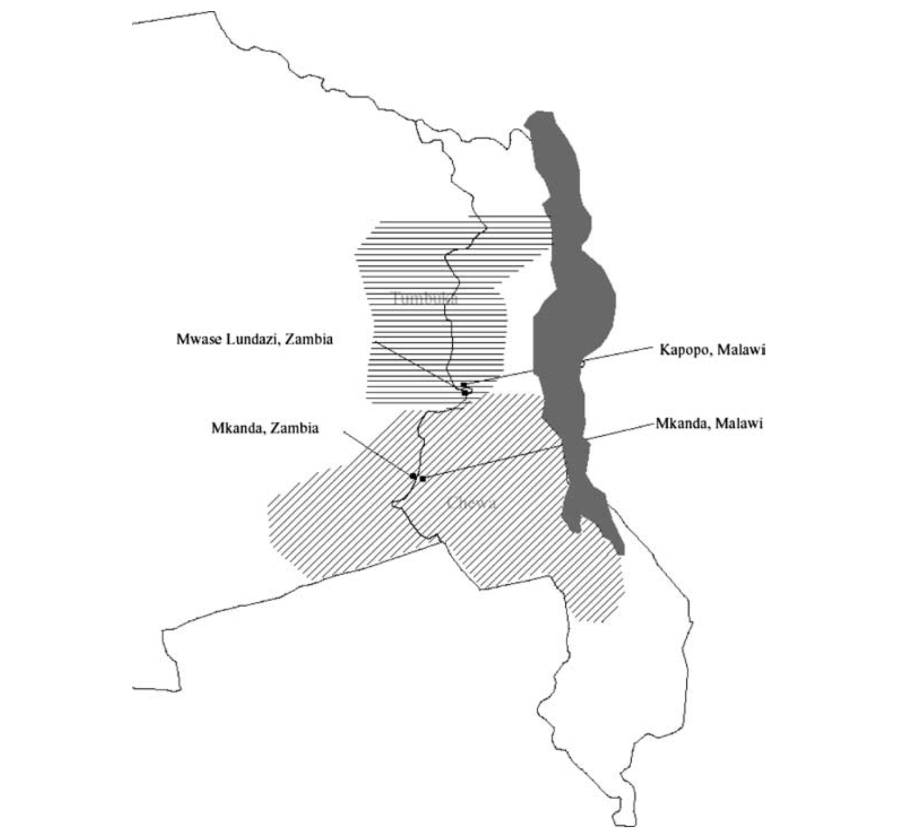

## 出席登録をお願いします

## 今日の目次

1. はじめに
1. 質的研究と量的研究
1. 差異法
1. 一致法
1. 質的研究実践
1. まとめ

# はじめに
::: {.notes}
目標15分
:::
## 先週のRPより (1/3)
> 生態学的誤謬のところで出てきた、アメリカの政党支持と所得のところがよくわからなかった。ここでは、州別１人あたりのGDPと、大統領選結果の相関関係が成り立っていないということですか？

::: {.fragment .fade-in}
> 今回、生態学的誤謬について学びましたが、実際の政治学研究では国レベルのデータしか得られないことも多いと思います。その場合、研究者はどのような工夫によって生態学的誤謬のリスクを減らしているのでしょうか。

:::

::: {.notes}
生態学的誤謬…集団レベルの相関が個人レベルでは成り立っていないこと

- アメリカの例：州レベルと有権者レベルで投票選択と所得の関係が逆
   - 州：貧しい州が共和党、豊かな州が民主党
   - 個人：貧しい人が民主党、豊かな人が共和党

生態学的誤謬への対処（レベルが高い質問）

- できるだけ興味に近いデータを集めるようにする
   - 個人に関心→個人のデータ
- 集計レベルしか取れない時→論文でそのことを素直に認める
   
:::

## 先週のRPより (2/3)
> 観測の単位と分析の単位の違いがまだよくわからない。

::: {.fragment .fade-in}
> 分析の単位は基本的に細かくできる限りなるべく細かい方がよいという認識でいいですか？

:::

::: {.notes}
分析の単位と観測の単位は同じ

分析の単位の細かさ→興味関心と合わせるべき

- 細かければ細かいほどいいというものではない

:::

## 先週のRPより (3/3)
> サンプル選択は因果効果の推定も歪める可能性での、独立変数の値に基づいた場合は問題なしの部分がわからなかった。独立変数で選べば絶対安全(歪まない)ということか。

::: {.fragment .fade-in}
> なぜTOEIC700点以上に絞ると因果効果が過少に評価されるのかよく理解できなかった。

:::

::: {.notes}
独立変数と従属変数のサンプリング…時間の関係上詳しい説明はできない（パールのDAGモデル）

- 独立変数→基本的には大丈夫
- 従属変数→補足ビデオのバークソンのパラドックスと同じことが発生
   - 洋画視聴時間が短いのに点数が高い人（＝いわゆる「地頭がいい人」）が混ざる
   - 結果、「洋画を見ない＝地頭がいい」という偽の負の相関ができる
   - 洋画を見ることの正の効果を打ち消す

:::

## 本日の目的と到達目標
::: {style="font-size: 0.9em;"}
#### 目的
少数の事例から因果関係を検証する方法を学ぶ。量的研究と質的研究それぞれの利点と限界を議論するとともに、質的研究の枠組みとして「一致法」と「差異法」を学び、実際に自分で行ってみる。

::: {.fragment .fade-in}
#### 到達目標
1. 量的研究と質的研究それぞれの利点と限界を説明できる。
1. 比較の枠組みとしての差異法の利点と限界を説明できる。
1. 比較の枠組みとしての一致法の利点と限界を説明できる。
1. 差異法あるいは一致法に基づく少数事例の比較から因果関係を推論できる。

:::

:::

## 本日の授業の位置付け

# 質的研究と量的研究
::: {.notes}
ここまで15分

目標15分
:::
## 2つの研究スタイル
::: {.columns}
::: {.column width=50%}
::: {.fragment .fade-in}
#### 量的研究 (quantitative study)
**多くの事例**を分析

- 例：1000人の就職データ

:::
:::

::: {.column width=50%}
::: {.fragment .fade-in}
#### 質的研究 (qualitative)
**少数の事例**を分析

- 例：先輩に就活について聞く

:::
:::
:::

::: {.fragment .fade-in}
広さと深さのトレードオフ

::: {.fragment .fade-in}
|            | 量的研究 | 質的研究 | 
| ---------- | -------- | -------- | 
| **外的妥当性** | 高い     | 低い     | 
| **考察**       | 浅い     | 深い     | 

:::

:::

::: {.notes}
#### 量的研究 (quantitative study)
多くの事例を分析する研究

- 例：駒大生1000人の就職データの分析
- 一般性の高い推論を導ける
   - Cf.大数の法則、中心極限定理
- 深い考察はできない
   - 性格テストや成績、専攻などありきたりな情報

#### 質的研究 (qualitative study)
少数の事例を分析する研究

- 例：先輩に就活経験を聞く
- 1つ1つの事例を深く考察できる
   - ESの文言、面接で何を聞かれたか
- 推論の外的妥当性が低い
   - サンプリングバイアスがあるかも

:::

## 質的研究の枠組み
::: {.columns}
::: {.column width=65%}
**ジョン・ステュアート・ミル**の比較法

::: {.incremental}
- **差異法**…異なった結果を示す複数の事例を比較
- **一致法**[^moa_trans]…同じ結果を示す複数の事例を比較

[^moa_trans]: 教科書では「合意法」と訳されているが、誤訳なので本授業では「一致法」と呼ぶ。

:::

:::

::: {.column width=5%}

:::

::: {.column width=30%}

:::

:::

## クイズ
以下のような推論はそれぞれ差異法と一致法どちらに基づいているでしょうか。

1. 中東の産油国はいずれも独裁国家だ。石油の存在は民主主義を阻害するのであろう。
1. 直近の総理大臣は3人とも自民党の3役（幹事長・政調会長・総務会長）いずれかの経験者だ。総理総裁になるためには3役経験が必要なのだろう。
1. アメリカは二大政党制でドイツは多党制だが、その原因は選挙制度が異なるためであろう。
1. 衆院選挙で自民党が勝ち中道が負けたのは、自民の党首が女性だったのに対して中道の党首がおじさん2人だったからだ。

[WebClassで回答](https://webclass.komazawa-u.ac.jp/webclass/login.php?id=1f00649b12945035ad650f02e66d1e80&page=1)

# 差異法
::: {.notes}
ここまで30分

目標15分
:::
## 差異法 (method of difference)
**異なった結果**を示す複数の事例を比較し、その**違いをもたらした原因**を推論

::: {.fragment .fade-in}

例：[エスピン＝アンデルセンの比較福祉国家研究](https://www.amazon.co.jp/%E7%A6%8F%E7%A5%89%E8%B3%87%E6%9C%AC%E4%B8%BB%E7%BE%A9%E3%81%AE%E4%B8%89%E3%81%A4%E3%81%AE%E4%B8%96%E7%95%8C-MINERVA%E7%A6%8F%E7%A5%89%E3%83%A9%E3%82%A4%E3%83%96%E3%83%A9%E3%83%AA%E3%83%BC-%E3%82%A4%E3%82%A8%E3%82%B9%E3%82%BF-%E3%82%A8%E3%82%B9%E3%83%94%E3%83%B3%E2%80%90%E3%82%A2%E3%83%B3%E3%83%87%E3%83%AB%E3%82%BB%E3%83%B3/dp/4623033236)

::: {.incremental}
- 英語圏・大陸欧州・北欧で福祉のあり方が違うのはなぜ？

:::

::: {.fragment .fade-in}

| 福祉のあり方             | 階級間関係               | 
| ------------------------ | ------------------------ | 
| **自由主義** （英語圏）   | 労働者＋農民＋中間層連合 | 
| **保守主義** （大陸欧州） | 保守派＋官僚＋管理職連合 | 
| **社民主義** （北欧）     | 資本家一強               | 

:::
:::

::: {.notes}
3つの福祉レジーム

- 自由主義…全般的に福祉が手薄
- 保守主義…福祉は手厚いが階層間で差
   - 例：職域別の年金制度
- 社民主義…手厚い福祉が平等に提供

（詳しくは崔先生の政治経済学で）

:::

## ワーク
> アメリカは二大政党制でドイツは多党制だが、その原因は選挙制度が異なるためであろう。つまりアメリカは小選挙区制、ドイツは比例代表制を採用していることが政党制の違いを生み出している。

::: {.fragment .fade-in}
この推論を、因果関係の3条件の観点から評価して下さい。

- [ ] 共変関係は成立している？
- [ ] 原因は時間的に先行している？
- [ ] 他の変数は統制されている？

[WebClassチャット](https://webclass.komazawa-u.ac.jp/webclass/login.php?id=f702b411a98d4c4ae9b6d267022b39b4)に入力してください（周りと相談しても可）

:::

::: {.notes}
ワーク

- 目的：差異法の利点と限界に気づく
- 質問「以下の差異法に基づく推論を、因果関係の3条件の観点から評価して下さい。「アメリカは二大政党制でドイツは多党制だが、その原因は選挙制度が異なるためであろう。つまりアメリカは小選挙区制、ドイツは比例代表制を採用していることが政党制の違いを生み出している。」」
  - 共変関係は成立している？
  - 原因は時間的に先行している？
  - 他の変数は統制されている？
- 問いかけ：2分考える（周りと相談しても可）→WebClassチャットで共有

:::

## 差異法の利点と限界

::: {.fragment .fade-in}
**共変関係**は確認できている

::: {.incremental}
- アメリカ：小選挙区→二大政党制
- ドイツ：比例代表制→多党制

:::
:::

::: {.fragment .fade-in}
**原因の時間的先行**も研究設計次第では可能

::: {.incremental}
- 選挙制度と政党制どちらが先かは微妙
- 福祉国家論では大丈夫

:::
:::

::: {.fragment .fade-in}
**他の変数の統制**がしにくい

::: {.incremental}
- 米独には選挙制度と政党制以外にも異なる点多数

:::
:::

## 差異法での変数統制
::: {.fragment .fade-in}
理論的検討

- 先行研究で指摘されている交絡変数が効果がないことを確認
   - 例：スレーターのアジア権威主義研究

:::

::: {.fragment .fade-in}
**Most Similar Systems Design** (MSSD)

- 従属・独立変数以外はできるだけ類似している事例同士を比較

:::

::: {.fragment .fade-in}
**自然実験** (natural experiment)

- 擬似的に実験とみなせるような状況を利用

:::

## MSSDの例
福祉国家の発展と労働組合の強さ

::: {.fragment .fade-in}
|              | 福祉国家     | 労働組合 | 民主主義 | 経済発展     | 
| ------------ | ------------ | -------- | -------- | ------------ | 
| スウェーデン | 高度         | 強い     | 発展     | 高度         | 
| アメリカ     | 低度         | 弱い     | 発展     | 高度         | 
| 北朝鮮       | きわめて低度 | 不在     | 不在     | きわめて低度 | 

:::

::: {.fragment .fade-in}
→スウェーデンの比較相手は北朝鮮よりもアメリカの方が良い

:::

::: {.notes}
とみビデオの例も入れる？
:::

## 自然実験の例
{.r-stretch}

::: {.notes}
Posner (2004)の研究

- 民族紛争の原因は何か？→対立する民族の相対的な規模
- ザンビアとマラウィの比較
   - 国境線は植民地化の過程で恣意的→ランダムとみなして良い
   - チェワ・ツンブカの規模と関係性だけが異なる

:::

# 一致法
::: {.notes}
ここまで45分

休憩5分

目標15分
:::
## 一致法 (method of agreement)
同じ結果を示す複数の事例を比較し、共通する要因を原因とみなす

::: {.fragment .fade-in}
例：福祉国家発展の例

|              | 福祉拡充度 | 労働組合 | 
| ------------ | ---------- | -------- | 
| スウェーデン | 高度       | 強い     | 
| ノルウェー   | 高度       | 強い     | 

:::

::: {.fragment .fade-in}
**共通するパターンの析出**に使える

::: {.incremental}
- 例：ブリントン『革命の解剖』
   - 旧体制の崩壊→権力移行→恐怖支配→反動

:::
:::

## ワーク
> 直近の総理大臣は3人とも自民党の3役（幹事長・政調会長・総務会長）いずれかの経験者だ。総理総裁になるためには3役経験が必要なのだろう。

::: {.fragment .fade-in}
この推論を、因果関係の3条件の観点から評価して下さい。

- [ ] 共変関係は成立している？
- [ ] 原因は時間的に先行している？
- [ ] 他の変数は統制されている？

[WebClassチャット](https://webclass.komazawa-u.ac.jp/webclass/login.php?id=f702b411a98d4c4ae9b6d267022b39b4)に入力してください（周りと相談しても可）

:::

## 一致法の限界
::: {.fragment .fade-in}
**共変関係**を確認していない

::: {.incremental}
- この時点で差異法に劣る

:::
:::

::: {.fragment .fade-in}
**原因の時間的先行**は研究設計による

::: {.incremental}
- 福祉発展と労働組合→同時性の可能性

:::
:::

::: {.fragment .fade-in}
**他の変数の統制**はしにくい

::: {.incremental}
- ノルウェーとスウェーデンは同じ値を取る変数が多数
   - どれが本当の要因かはわからない

:::
:::

## Most Different Systems Design (MDSD)
できるだけ異なった事例を比較し、その中でも独立変数と従属変数が共通の値を取っていればそれが原因

::: {.fragment .fade-in}
例：福祉国家発展の例

|              | 福祉拡充度 | 労働組合 | 経済成長 | 選挙制度   | 気候 | 
| ------------ | ---------- | -------- | -------- | ---------- | ---- | 
| スウェーデン | 高度       | 強い     | 高度     | 比例代表制 | 寒冷 | 
| X国          | 高度       | 強い     | 低度     | 小選挙区制 | 熱帯 | 

:::

::: {.fragment .fade-in}
ただし共変関係の確認はできていないことに注意

:::

# 質的研究実践
::: {.notes}
ここまで20分

目標15分
:::
## ソロ＋ペアワーク (-20分)
**ソロワーク**（5-6分）…次のテーマから1つ選び、少数の事例を比較して仮説を導いて下さい。

- テーマ：政治、スポーツ、大学受験、アルバイト
- 事例は最大3つ（具体的に）、共通点／相違点は何か？
- 仮説：◯◯なのは〜〜だからである。

::: {.fragment .fade-in}
**ペアワーク**（3-4分）…近くでワークシートを交換し、以下についてチェック

- [ ] 差異法か一致法か
- [ ] 原因と結果は明確か
- [ ] 原因は時間的に先行しているか
- [ ] 他の変数は統制されているか

:::

::: {.notes}
事例は具体的に

- AさんBさん、国（アメリカ、日本、中国）
:::

---

**共有**（2-3分）…[WebClassチャット](https://webclass.komazawa-u.ac.jp/webclass/login.php?id=f702b411a98d4c4ae9b6d267022b39b4)

- できれば他の人の比較で面白かったものを投稿

{.r-stretch}

# まとめ
## 本日の目的と到達目標
::: {style="font-size: 0.9em;"}
#### 目的
少数の事例から因果関係を検証する方法を学ぶ。量的研究と質的研究それぞれの利点と限界を議論するとともに、質的研究の枠組みとして「一致法」と「差異法」を学び、実際に自分で行ってみる。

::: {.fragment .fade-in}
#### 到達目標
1. 量的研究と質的研究それぞれの利点と限界を説明できる。
1. 比較の枠組みとしての差異法の利点と限界を説明できる。
1. 比較の枠組みとしての一致法の利点と限界を説明できる。
1. 差異法あるいは一致法に基づく少数事例の比較から因果関係を推論できる。

:::

:::

## 次回までに
::: {.fragment .fade-in}
#### 事後学習

 - 授業資料を見直し、目標到達をセルフチェック
 - WebClass 上でのリアクションペーパー入力（金曜日まで）
 
:::

::: {.fragment .fade-in}
#### 事前学習

 - 教科書（久米10章）を読み、WebClass上でのチェックフォーム記入

:::