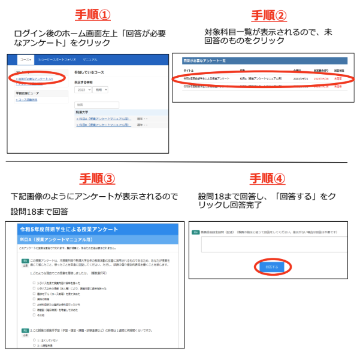

## 出席登録をお願いします

## 今日の目次

1. はじめに
1. 規範と経験
1. 戦後日本政治学
1. 政策提言の評価実践
1. EBPMとその課題
1. まとめ

# はじめに
::: {.notes}
目標15分
:::
## 授業アンケート回答
{.r-stretch}

::: {.notes}
授業アンケート（5-10分）

- 回答内容は匿名処理
- 自由記入欄では誹謗中傷・差別的表現は禁止
- 単なる批判や言い放しではなく、建設的に
   - 「〜〜だから、△△のように改善してもらえると良くなると思います」
- 回答は5-10分で終了、スマートフォンやPCなどからWebClassにアクセス
- 回答が終わらなくても期間内であれば回答可能（7/14まで）
- 回答手順の詳細はKONECO「授業アンケートの回答方法について」

:::

## 先週のRPより
> 個人の主観などに左右されず、数字という誰が見ても納得できる明確な根拠がある量的研究志向に同意する。一般化もできるため、それにより一般法則も導ける。

::: {.fragment .fade-in}
> 私は質的研究志向に同意する。変数志向型の手法で全体の傾向を比較する良さも分かるが、一つの事例を深掘りして「なぜそうなったのか」や新しい問いを発見していくことに、私は政治学としての本当の面白さを感じた。

:::

## 本日の目的と到達目標
::: {style="font-size: 0.9em;"}
#### 目的
これまで扱ってきた経験的議論の方法論が、実際の政治に関する規範的議論とどのような関係にあるのかを考える。戦後日本政治学の潮流を概観した後、具体的な政策提言について実証的な根拠の面から検討し、その効用と限界を理解する。

::: {.fragment .fade-in}
#### 到達目標
1. 経験的議論が規範的議論の前提になっているということを説明できる。
1. 戦後政治学における啓蒙主義的な立場とレヴァイアサングループの間の論争を説明できる。
1. 世間に流布する政策提言の実例を実証的な面から評価することができる
1. 根拠の基づいた政策提言（EBPM）の課題を3つ挙げることができる。

:::

:::

## 本日の授業の位置付け

# 規範と経験
::: {.notes}
ここまで15分

目標15分
:::
## クイズ
以下の議論は規範的議論でしょうか、それとも経験的議論でしょうか

1. 若者の投票率は高齢者の投票率よりも低い
1. 政府は環境問題対策をもっと強化する必要がある
1. 地方の過疎化を防ぐために更なる対策を行うべきだ
1. SNSにより政治における合意形成が困難になっている

[WebClassで回答](https://webclass.komazawa-u.ac.jp/webclass/login.php?id=25704ce289fd799e414aab121bb96e3d&page=1)

{.r-stretch}

## 復習：二つの種類の議論
::: {.fragment .fade-in}
#### 規範的議論（normative discussion）
「何が正しい／望ましいのか」をめぐる議論

::: {.incremental}
 - **「べき」論**→**価値判断**を伴う
    - 例：人を殺すことはいけない

::: 

:::

::: {.fragment .fade-in}
#### 経験的議論（empirical discussion）
「何が、なぜ起こっているのか」をめぐる議論

::: {.incremental}
 - **「である」論**→価値判断を伴わず、あくまで**事実**のみ
    - 例：あの人は人を殺した

:::

:::

## 少子化対策の例 {#agedpop}

政策提言は規範的議論の一種

::: {.fragment .fade-in}
> 少子化が進んでいるのは問題だ。子ども手当を手厚くすべきだ。

:::

::: {.incremental}
- 少子化は進んでいるのか？
- 子ども手当に少子化を抑制する効果はあるのか？

:::

::: {.fragment .fade-in}
→明らかしないまま手当支給すると税金のムダになるかも

:::

## 経験と規範：政治の文脈では

一般に…

::: {.incremental}
- 規範と経験は別の営為
- 規範の前提としての経験

:::

::: {.fragment .fade-in}
政治学特有の困難→戦後日本政治学

::: {.incremental}
- 現代は市民全員が政治の当事者
- 研究者も含めて政治的意見
- 規範と経験の混同が特に起こりやすい

:::
:::

# 戦後日本政治学
::: {.notes}
ここまで30分

目標15分
:::

<!-- 酒井（2024）[^sakai2024] -->

<!-- [^sakai2024]: 酒井大輔（2024）『[日本政治学史－丸山眞男からジェンダー論、実験政治学まで](https://www.chuko.co.jp/shinsho/2024/12/102837.html)』中央公論新社． -->

## 啓蒙主義的政治学
::: {}
戦後日本で有力だった政治学の潮流

::: {.incremental}
- 戦前の反省を踏まえた現状批判に主眼
   - 「遅れている」日本にいかに「真の民主主義」を根付かせるか？
      - 天皇制、戦争責任、自民党一党優位、官僚優位…
   - 「真の民主主義」→西洋が想定

:::
:::

---

::: {.columns}
::: {.column width=75%}
**丸山眞男**（1946）「超国家主義の論理と心理」[^maruyama2006]

::: {.incremental}
- ファシズムすらまともに持てなかった日本
   - 東京裁判「個人的には反対だったが…」
   - ニュルンベルク裁判「100%責任を取らなければらない」
- **中性国家**…個人的道徳からは自立した国家
   - 西欧は宗教戦争を経て確立
   - 日本は欠如し、国家と個人的道徳が一体化

:::
:::

::: {.column width=25%}

:::

:::

[^maruyama2006]: 丸山眞男（2006）『現代政治の思想と行動［新装版］』未来社．

::: {.notes}
丸山眞男

- 東京大学法学部教授
- 元々の専門は日本政治思想史
   - 荻生徂徠（江戸時代の儒学者）の研究で著名
   - 西洋政治思想史の枠組みで日本政治を読み解く
- 「夜店」として現代日本政治で活発に発言
   - いわゆる「進歩的文化人」の1人

:::

## アンケート

以下の主張に対してあなたは同意しますか、それとも同意しませんか。

1. 日本には政治経済を牛耳るエリート層が存在する。
1. 日本の政治は官僚よりも政治家が動かしている。
1. 日本政治は欧米と比べて特殊だ。

[WebClassで回答](https://webclass.komazawa-u.ac.jp/webclass/login.php?id=830bb7877630bcd452b263d13dceeb0d&page=1)

{.r-stretch}

## 『レヴァイアサン』
::: {.columns}
::: {.column width=75%}

1987年、雑誌『[レヴァイアサン](https://www.bokutaku.net/leviathan/index.html)』創刊[^leviathan]

::: {.incremental}
- 大嶽秀夫・村松岐夫・猪口孝ら**レヴァイアサン・グループ**

:::

::: {.fragment .fade-in}
啓蒙主義批判

::: {.incremental}
- 歴史・思想史・外国研究の片手間に評論的・印象主義的に日本政治を研究
- 日本政治を特殊日本的枠組みで解釈しようとする鎖国主義的・孤立主義的傾向

:::
:::

[^leviathan]: 2018年に休刊。

:::

::: {.column width=25%}

:::

:::

## レヴァイアサン・グループの成果

大嶽「日本の政治経済体制は多元主義」

::: {.incremental}
- 通説「日本はエリートが支配」
- 資料やインタビュー調査→エリート層の分散・機能的協力関係

:::

::: {.fragment .fade-in}
村松「日本の政治過程は政党優位」

::: {.incremental}
- 通説としての官僚優位説
- 官僚に対するインタビュー→政治家や政党への恐れ

:::
:::

::: {.fragment .fade-in}
猪口「日本における選挙経済循環」

::: {.incremental}
- 景気がいい時に解散総選挙→データを使って実証
- アメリカの政治的景気循環論と同じロジック→日本特殊論の否定

:::
:::

# 政策提言の評価実践
::: {.notes}
ここまで45分

休憩5分

目標20分
:::

## Think-pair-share (-20分）
以下は現在の日本政治で話題になっている政策提言の実例です。

1. 二重行政を解消するために大阪に特別区制度を導入するべきだ（大阪都構想）
1. 人口減少が見込まれる現代では国会議員の定数を削減するべきだ
1. 物価高に苦しむ家計を助けるために消費税を減税するべきだ
1. 治安のために移民の受け入れを減らすべきだ

::: {.fragment .fade-in}
この中から1つ選び、①まずそれが前提にしている経験的主張は何かを考えてください（[参考](#agedpop)）。②次にそれぞれの経験的主張は正しいかどうか考えてみてください。

:::

::: {.fragment .fade-in}
[WebClassチャット](https://webclass.komazawa-u.ac.jp/webclass/login.php?id=42019f9062a5c48d66a3ac2ee65a75ed)で共有

{.r-stretch}

:::

# EBPMとその課題
::: {.notes}
ここまで70分（1:10:00）

目標15分
:::
## 根拠に基づく政策形成
#### Evidence-Based Policy Making (EBPM)
政策の企画立案をその場限りのエピソードに頼るのではなく、政策目的を明確化したうえで政策効果の測定に重要な関連を持つ情報やデータ（エビデンス）に基づくものとすること（[参考](https://www.cao.go.jp/others/kichou/ebpm/ebpm.html)）

::: {.fragment .fade-in}
Q. 根拠に基づいた政策を立案・実施するため、政治は専門家に任せるべきであるという主張に賛成しますか、それとも反対しますか。

 - [WebClassアンケート](https://webclass.komazawa-u.ac.jp/webclass/login.php?id=38161999930e82d295f7fdf037cf502d&page=1)で入力

:::
 
## 3つの限界
政治との関係…政治的に可能か／望ましいか

::: {.incremental}
- 根拠に基づいていても政治的な反発はありうる
   - 例：マクロ経済政策…不景気の時に積極財政、好景気の時に緊縮財政
      - 後者は難しい
- **テクノクラシー**…専門家に政策を委ねる→民主主義と言えるか？

:::

::: {.fragment .fade-in}
不確実性…確率的な予測ができない事象

::: {.incremental}
- 過去のデータから「1億円分の追加の政府支出がGDP成長率を1%伸ばした」かはわかる
- 来年度の予算が何%のGDP成長率をもたらすかは不明

:::
:::

--- 

自己言及性…予測それ自体が社会に影響

::: {.incremental}
- 株価が上がるという予測→実際に上がる
- **バンドワゴン効果**…勝つと見込まれる候補者に票が集まる

:::

# まとめ
::: {.notes}
ここまで85分（1:25:00）

目標15分
:::
## 本日の目的と到達目標
::: {style="font-size: 0.9em;"}
#### 目的
これまで扱ってきた経験的議論の方法論が、実際の政治に関する規範的議論とどのような関係にあるのかを考える。戦後日本政治学の潮流を概観した後、具体的な政策提言について実証的な根拠の面から検討し、その効用と限界を理解する。

::: {.fragment .fade-in}
#### 到達目標
1. 経験的議論が規範的議論の前提になっているということを説明できる。
1. 戦後政治学における啓蒙主義的な立場とレヴァイアサングループの間の論争を説明できる。
1. 世間に流布する政策提言の実例を実証的な面から評価することができる
1. 根拠の基づいた政策提言（EBPM）の課題を3つ挙げることができる。

:::

:::

## 次回までに
::: {.fragment .fade-in}
#### 事後学習

 - 授業資料を見直し、目標到達をセルフチェック
 - WebClass 上でのリアクションペーパー入力（金曜日まで）
 
:::

::: {.fragment .fade-in}
#### 事前学習

 - 今までの授業全体を見直す。
    - 改めて目標到達をセルフチェック
    - まだ理解できていないところを書き出しておく

:::

## 来週（7/14）の授業
::: {.incremental}
- 対面ではなく**オンライン（Google Meet）**で実施
- 形式：グループワーク＋ギャラリーウォーク
   - テーマ別グループで授業内容復習→スライド作成
      - Googleの共有ドライブ上で作業
   - ギャラリーウォークで復習＋相互評価
- Google Meetおよび共有ドライブの招待は前日にKOMAnet Gmail上に送信

:::