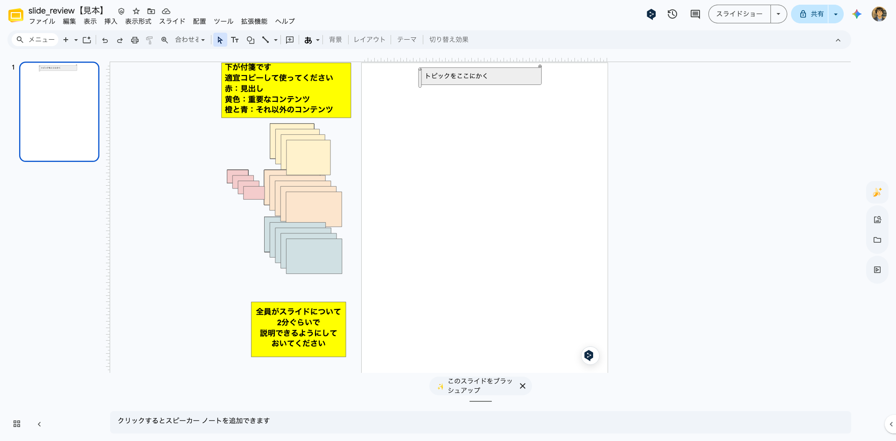
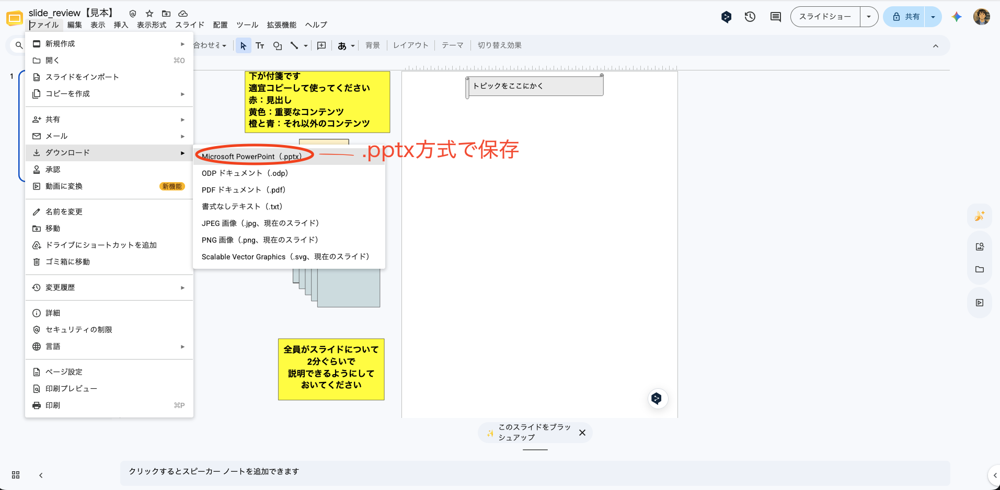
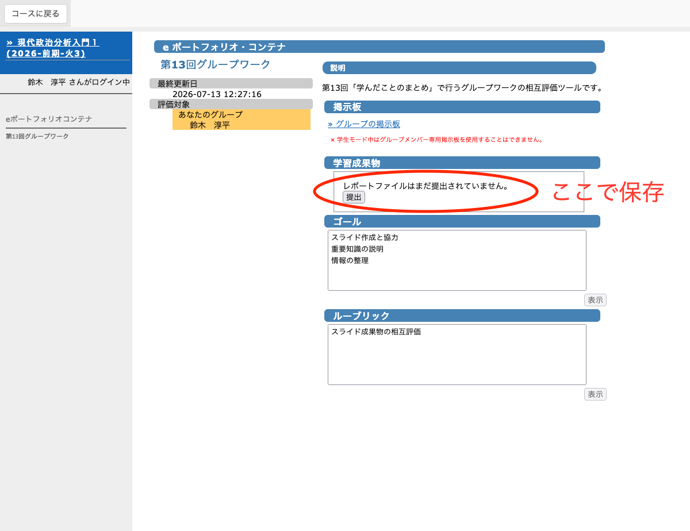
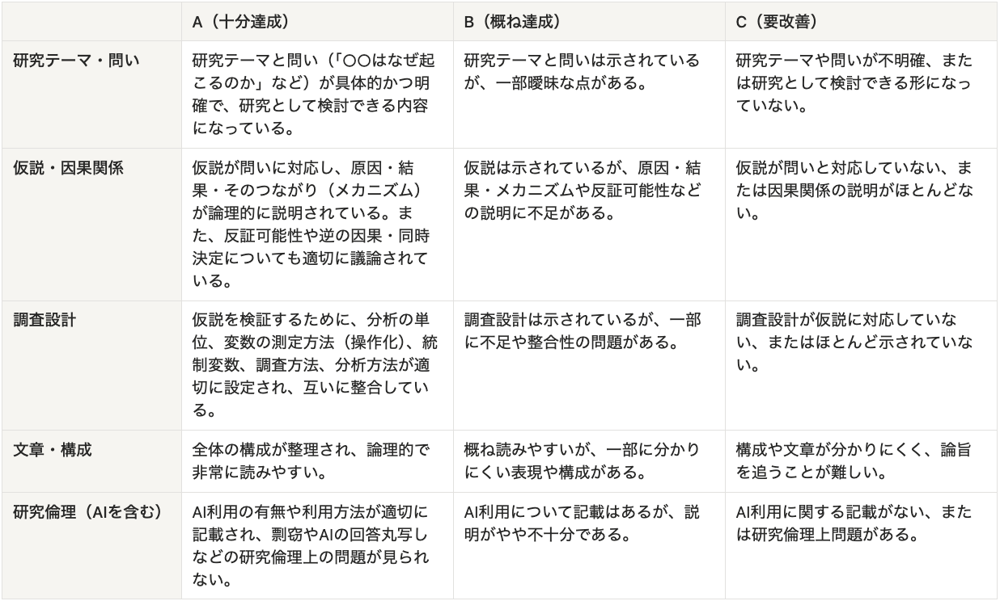
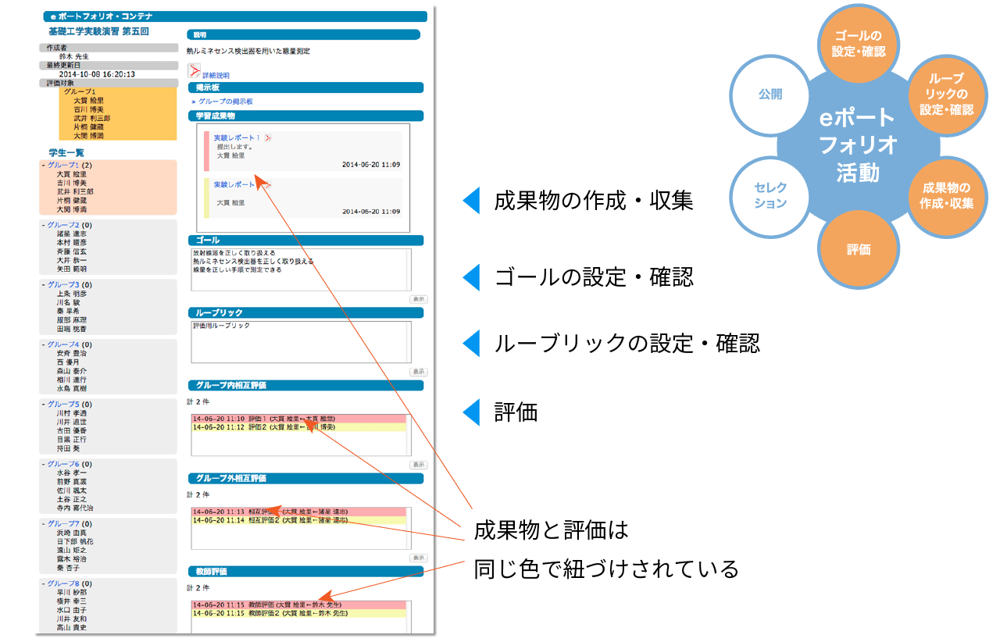

## 出席登録をお願いします

## 今日の目次

1. はじめに
1. グループワーク
1. ギャラリーウォーク
1. まとめ

# はじめに
## 本日の目的と到達目標
::: {style="font-size: 0.9em;"}
#### 目的
グループワークによるスライド作成とギャラリーウォークを行い、授業で学んだことを思い出して整理し定着を図る。

::: {.fragment .fade-in}
#### 到達目標
1. 各回で学んだ重要だと思うことを自分の言葉で説明できる
1. 周囲と協力しながら学習を深めることができる
1. 情報をわかりやすく整理したスライドを作成できる

:::

:::

## 本日の授業の位置付け

# グループワーク
## 目的と到達目標
#### 目的
今まで学んだことを思い出して整理し定着を図る

#### 到達目標
1. 授業内容を思い出し、有益な知識やアイデアを共有できる
1. 他のメンバーの意見を尊重しながら、議論を進められる
1. ポスターの構成や編集など、成果物の作成に貢献できる

## 方法
**スライド作成のGW＋ギャラリーウォーク**

::: {.incremental}
- 学んだことについてグループでテーマを分担し、スライドを作成
- 他のグループのスライドを見て復習
   - **グループ外相互評価**：復習の役に立ったかを評価

:::

::: {.fragment .fade-in}
作業はGoogleドライブの共有フォルダ上で行う

- KOMAnet Gmailアカウントでログインし、届いている招待メールからアクセスすること
- 組織外のアカウントではアクセスできません

:::

## テーマと担当グループ {.scrollable}
テーマと担当グループは以下の通り

- テーマA：**科学と説明①**（グループ**A1〜A6**）
    - 02/説明とは何か、03/反証可能性
- テーマB：**科学と説明②**（グループ**B1〜B6**）
    - 04/説明と一般化、05/推論としての記述
- テーマC：**因果関係①**（グループ**C1〜C6**）
    - 06/共変関係、07/原因の時間的先行
- テーマD：**因果関係②**（グループ**D1〜D6**）
    - 08/変数の統制、09/単位／選択／観察
- テーマE：**事例分析**（グループ**E1〜E6**）
    - 10/比較事例分析、11/単一事例分析

## グループ分け

[グループ分け表](https://webclass.komazawa-u.ac.jp/webclass/login.php?id=1a06c6e43f39c181286487390ba39100&page=1)を確認し、自分のテーマとグループを確認すること

::: {.incremental}
- WebClassとGoogle Drive共有フォルダにグループ分けリストあり
   - ファイルをダウンロードして検索してもよい
      - 個人情報が含まれているので取扱注意
   - WebClass「第13回グループワーク」（下の方）でも確認可能
- 来週以降のレポート作成もこのグループで行います

:::

## グループワークの手順（合計30分）  {.scrollable}
- （グループ）軽く自己紹介（**2分**）
   - **出席者の中で**あいうえお順1番目から
   - 学年と名前だけでよい
- （個人）そのテーマについて最も学んだことを2つ以上思い出し、「ふせん」1枚に1つずつ書き出す（**3分**）
- （グループ）書き出したことを手がかりに、ふせんや各到達目標を参考に各テーマについてまとめたスライドを作成（**20分**）
   - 役割：**出席者の中で**あいうえお順1番目の人がふせん整理、2番目の人が司会・タイムキーパー
   - ふせんやテキスト、囲み枠等を使いわかりやすく

---

{.r-stretch}

::: {.notes}
やり方はGoogleドライブ共有フォルダの見本を見せながら行う

- 同じスライドはリアルタイムで作業できる
- 付箋はコピー・ペーストできる
- 付箋をダブルクリックすると文字が入力できる
- 赤の小さい付箋は見出しに使う
   - サイズを適宜変えながら使える
   - 他の色分けは任意

:::

## スライドの保存と提出

- （個人）スライドをダウンロードして保存し提出（**5分**）
   - スライドツールバー上のファイル＞ダウンロード＞Microsoft PowerPoint (.pptx)
   - **出席者の中で**あいうえお順3番目の人が代表で行う
   - WebClassの「第13回グループワーク」に「学習成果物」のところで提出
      - グループメンバーなら誰でも、複数回提出できるがなるべく一回の提出にする

---

{.r-stretch}

---

{.r-stretch}

## 注意
<!-- - 作業時間の案内は教員が全体向けチャットで行います -->
<!--    - 作業が終わらなくても、教員の指示があったら次の活動へ移ってください。 -->
- 30分の中で時間を管理し、ファイルの提出まで完了させる。
   - 司会・タイムキーパーが自己紹介・ふせん記入・スライド作成・保存の時間を管理
   - 教員から個々にブレイクアウトにメッセージを送ることはできない
- 各グループで欠席者がいても、2人以上出席していたらそのグループは成立したとみなします。
   - 各グループに移動した後、5分経っても自分1人しかいない状況となった場合、ブレイクアウトルームを離れて教員のいる全体ルームに戻ってきてください。
      - 人数を確認の上、同じテーマの別グループに案内します。
      - 新しい人が来たら暖かく迎えてあげてください。

---

- 教員は全体ルームにいるので問題発生時はブレイクアウト上部「サポートをリクエスト」を押してください
   - 順番に駆けつけます

## ブレイクアウト・スライドへの移動

自分のブレイクアウトルーム・スライドに行くには…

- Google Meet→右下の会議ツールから、ブレイクアウトルーム
   - 例：グループA1→ブレイクアウトA1
- Google Drive→グループに対応するスライド
   - 例：グループA1→slide_review_A1
- 担当を確認・決定
   - あいうえお順1番目→ふせん整理
   - あいうえお順2番目→司会・タイムキーパー
   - あいうえお順3番目→提出者
   - 臨機応変に対応しても可能

::: {.fragment .fade-in}
**それでは、移動してください**
:::

# ギャラリーウォーク
## ギャラリーウォークの手順
- （個人）自分が担当しなかった4テーマそれぞれのスライドを1つずつ見る（合計4枚）
   - 割り当て：同じ番号の別テーマのグループ
      - A1⇄B1⇄C1⇄D1⇄E1
      - A2⇄B2⇄C2⇄D2⇄E2
      - …

::: {.fragment .fade-in}
- （個人）スライドを見たらグループ外相互評価（WebClass）
   - 内容の正確さ、わかりやすさ、復習への有用性
   - 対象外のグループは評価の必要なし

:::

## ルーブリック（採点基準）
{.r-stretch}

## 相互評価
{.r-stretch}

## 相互評価（20分）{.smaller}

- 割り当て：同じ番号の別テーマのグループ
   - A1⇄B1⇄C1⇄D1⇄E1
   - A2⇄B2⇄C2⇄D2⇄E2
   - A3⇄B3⇄C3⇄D3⇄E3
   - A4⇄B4⇄C4⇄D4⇄E4
   - A5⇄B5⇄C5⇄D5⇄E5
   - A6⇄B6⇄C6⇄D6⇄E6
- WebClass「第13回グループワーク」（下の方）を開いて作業
   - 左の「学生一覧」から対象グループを選択
   - 右の「グループ外相互評価」から課題を選択し採点
      - 複数あったら最新版を対象とする
      - Google Driveの方を見ても良い

::: {.fragment .fade-in}
**相互評価を開始してください**
:::

# まとめ
## 本日の目的と到達目標
::: {style="font-size: 0.9em;"}
#### 目的
グループワークによるスライド作成とギャラリーウォークを行い、授業で学んだことを思い出して整理し定着を図る。

::: {.fragment .fade-in}
#### 到達目標
1. 各回で学んだ重要だと思うことを自分の言葉で説明できる
1. 周囲と協力しながら学習を深めることができる
1. 情報をわかりやすく整理したスライドを作成できる

:::
:::

## 次回までに
::: {.fragment .fade-in}
#### 事後学習

 - 改めて授業資料を全体的に見直す
 - WebClass 上でのリアクションペーパー入力（金曜日まで）
    - グループワークをやってみた感想・提案
 - 授業評価アンケート未回答の方は回答すること（本日14日まで）
    
:::

::: {.fragment .fade-in}
#### 事前学習

 - 政治現象や社会現象について、自分が検証したい仮説を2〜3個書き留めておく。

:::

## 来週以降の予告
**来週（7/20）も本日と同様オンライン開催**

- 本日と同じグループでレポート作成準備
- 政治現象をめぐる仮説構築とその検証方法の計画

**再来週は課題授業とし、リアルタイム授業はなし**

- レポートの完成・提出とグループ間相互採点
