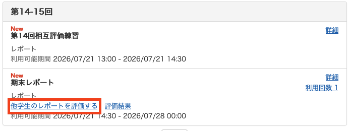
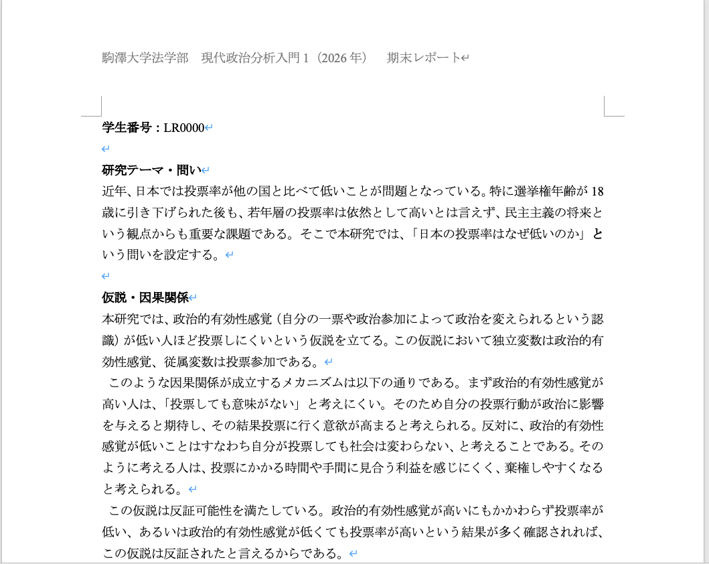
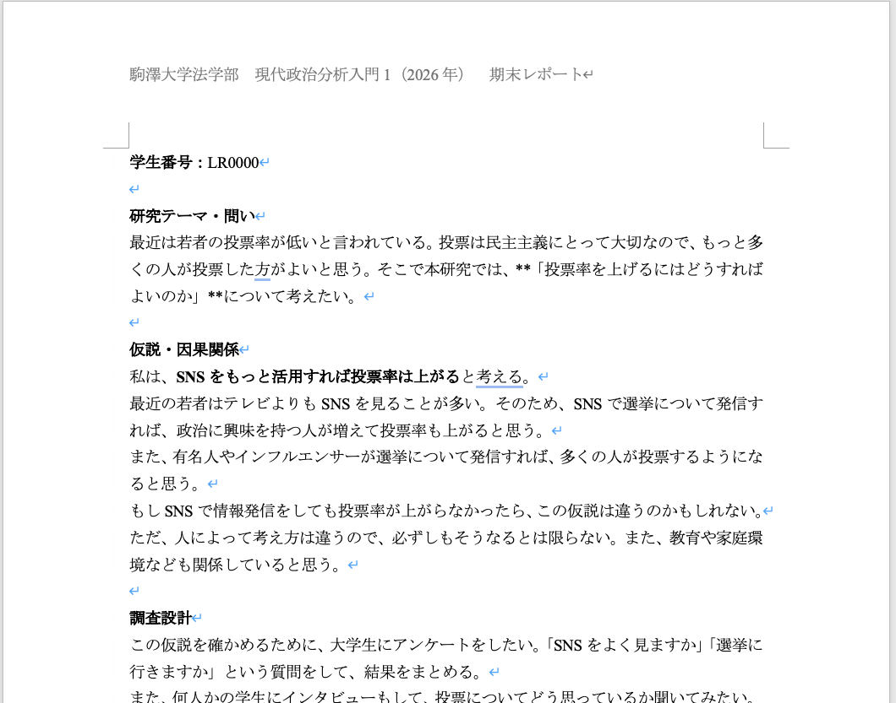

## 出席登録をお願いします

## 今日の目次

1. はじめに
1. 成績評価
1. レポート
1. ルーブリックの紹介
1. 相互評価
1. まとめ

# はじめに
::: {.notes}
目標10分
:::
## 本日の目的と到達目標
::: {style="font-size: 0.9em;"}
#### 目的
期末レポートに向けての準備をする。レポートの事務連絡とともにルーブリック（採点基準）を紹介し、何をかくべきか理解する。またこのルーブリックを用いて模擬答案を採点する練習を行い、相互評価のための経験を積む。

::: {.fragment .fade-in}
#### 到達目標
1. レポート課題に関する事務的な手続きの概要を説明できる。
1. レポートの採点基準を説明できる。
1. 実際に書かれたレポートを採点できる。
1. 何を書くべきかを押さえたレポートを執筆できる。

:::

:::

## 本日の授業の位置付け

# 成績評価
::: {.notes}
ここまで10分

目標15分
:::
## 当初の評価項目 {.smaller}
**平常点**（30%）⋯事前学習と事後学習に対する取り組み（WebClass上）

 - 事前学習（教科書）のチェックフォーム（授業開始まで；10%）
 - 100字程度のリアクションペーパー（金曜日まで；20%）
 
**復習セッション**（20%）⋯授業内容のふりかえり（第13回）

 - 5〜6人程度の班を作り、割り当てられた回の授業内容をスライドにまとめる
 - スライド相互評価（10％）
 
**レポート**（50%）⋯研究計画案の作成

 - 復習セッションと同じ班で研究計画案の作成
 - WebClass上での提出（10%）、作業への貢献度（相互評価；10%）、クオリティ（相互評価；10%）

## 新しい評価項目
**平常点**（**40%**）⋯事前学習と事後学習に対する取り組み（WebClass上）

 - 事前学習（教科書）のチェックフォーム（授業開始まで；10%）
 - 100字程度のリアクションペーパー（金曜日まで；**30%**）
 
**レポート**（**60%**）⋯研究計画案の作成

 - **個人で**研究計画案の作成
 - **教員による評価（20%）、履修者間の相互評価（40%）**

::: {.notes}
先週の失敗を踏まえつつ、影響が最小限になるようにした。
:::

# レポート
::: {.notes}
ここまで25分

目標20分
:::
## レポートの概要
以下の3つの課題に答えるレポートを作成してください。

::: {.incremental}
1. 興味のある政治・社会現象を1つ選ぶ。
1. その現象の原因（＝なぜ？）を説明する仮説を立てる。
1. その仮説を検証するための方法を設計する。

:::

## 提出

WebClass上で提出

::: {.incremental}
- 「第14-15回」の「期末レポート」
- 添付のフォーマットを用いて作成・提出
- 分量は**1-2ページ程度**

:::

::: {.fragment .fade-in}
提出期間：**7月21日14:30-27日24:00**

::: {.incremental}
- WebClass上の締切は28日00:00と設定
- 期間外の提出は**一切受け付けない**

:::

:::

::: {.notes}
提出期間について

- とにかく余裕を持って提出する
- 「締切間際になって提出しようとしてアクセスできなかった」などは受け付けない
:::

## 注意
::: {.incremental}
- 提出する際にはファイル名の「学生番号」を自分のものに書き換える。
   - 例：「現代政治分析入門1期末レポート_LR0000.docx」
- レポート本体では学生番号以外の個人情報を書かない。
- 剽窃（コピペ）や生成AIの丸写しは不正行為であり、発覚次第教務部に通報の上厳正に対処。
   - 他人の著作物を引用する際は[社会学評論スタイルガイド](https://jss-sociology.org/bulletin/guide/document/)にしたがい適切に行うこと。

:::

## 生成AIの使用
生成AIを使うこと自体は悪いことではないし、適切な使い方を覚えることも必要（[参考](https://www.komazawa-u.ac.jp/topics/2023/0427-14264.html)）

::: {.incremental}
 - いわゆる「**壁打ち**」…アイデア出しや文章の修正など
 
:::

::: {.fragment .fade-in}
ただし使った場合は明記する（フォーマット上に記入欄あり）

::: {.incremental}
- 使ったかどうか（使っていない場合はその旨明記）
- 何を使ったか（ChatGPT、Gemini…）
- どのように使ったか（アイデア出し、文章の修正…）

:::
:::

## レポートの相互評価
提出後はWebClass上で相互評価

::: {.incremental}
- 1人につき他の履修生**4+α人分**
- **ルーブリック**（採点基準）を用いる
   - 詳細は後ほど

:::

::: {.fragment .fade-in}
評価期間：**7月28日00:00-31日24:00**

::: {.incremental}
- Webclass「第14-15回」の「期末レポート」
   - 提出期間が終了した後すぐに可能
- 「他学生のレポートを評価する」で可能

:::
:::

---

{.r-stretch}

## 注意
::: {.incremental}
- WebClass上は評価期間は表示されない
   - WebClassのメッセージ機能でアナウンスします
- レポート未提出の場合には相互評価に参加不可
- 期間内に相互評価未提出の場合にはレポート未提出と扱う

:::

# ルーブリックの紹介
## ルーブリック
レポートの採点基準であり、次の5観点それぞれについて、**A（十分達成）、B（概ね達成）、C（要改善）**の3段階で評価

::: {.incremental}
- 研究テーマ・問い
- 仮説・因果関係
- 調査設計
- 文章・構成
- 研究倫理

:::

## 実際のルーブリック
{.r-stretch}

# 相互評価の練習
## ワーク（15分）
今から模擬レポート答案を2通読み、それぞれルーブリックに基づいて評価してもらいます。

::: {.fragment}
WebClassの「[第14回相互評価練習](https://webclass.komazawa-u.ac.jp/webclass/login.php?id=e111328a58eb2ae9a8d89f58362c818b&page=1)」にアクセスして、評価を提出してください。

{width=30%}

:::

## 模擬答案1
{.r-stretch}

::: {.notes}
ChatGPTにつくらせたものを鈴木が手直し

- 研究テーマ・問い…A-B
- 仮説・因果関係…A-B
- 調査設計…A
- 文章・構成…A
- 研究倫理…A
:::

## 模擬答案2
{.r-stretch}

::: {.notes}
ChatGPTにつくらせたものをそのままコピペ

- 研究テーマ・問い…B-C
- 仮説・因果関係…B-C
- 調査設計…C
- 文章・構成…C
- 研究倫理…C
:::

# まとめ
## 本日の目的と到達目標
::: {style="font-size: 0.9em;"}
#### 目的
期末レポートに向けての準備をする。レポートの事務連絡とともにルーブリック（採点基準）を紹介し、何をかくべきか理解する。またこのルーブリックを用いて模擬答案を採点する練習を行い、相互評価のための経験を積む。

::: {.fragment .fade-in}
#### 到達目標
1. レポート課題に関する事務的な手続きの概要を説明できる。
1. レポートの採点基準を説明できる。
1. 実際に書かれたレポートを採点できる。
1. 何を書くべきかを押さえたレポートを執筆できる。

:::

:::

## 残りやるべきこと
レポートの完成・提出

- 提出期間：**7月21日14:30-27日24:00**

レポートの相互評価

- 評価期間：**7月28日00:00-31日24:00**

::: {.fragment .fade-in}
::: {.r-fit-text}
半年間ありがとうございました！

:::
:::